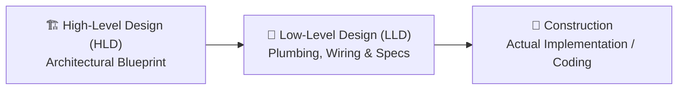
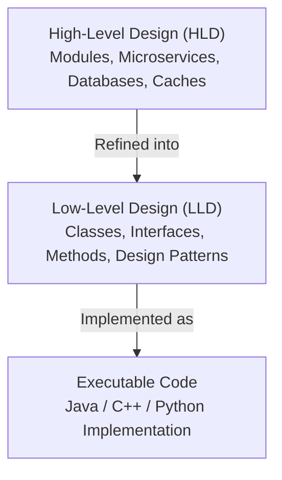
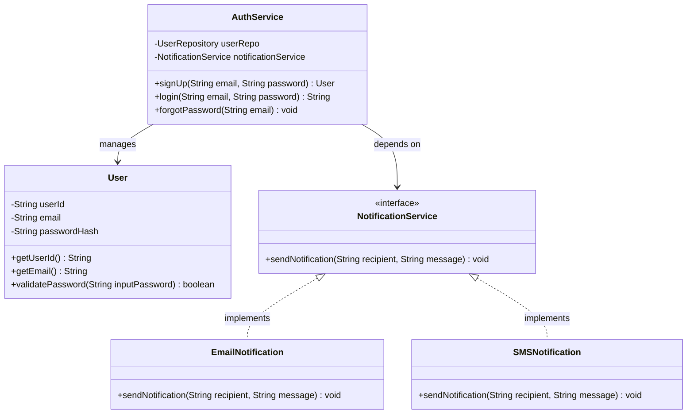

# Introduction to Low-Level Design (LLD)

> The detailed blueprint bridging high-level architecture and clean, robust, executable code.

## What You'll Learn

By the end of this chapter, you'll understand:

- What Low-Level Design (LLD) is and where it fits in the software development lifecycle
- The Real-Life Analogy: High-Level Design (HLD) vs. Low-Level Design (LLD)
- Formal definition and core objectives of LLD
- A practical coding example in Java (Authentication & Notification System)
- Key characteristics of LLD (Granular, Implementation-Focused, OOP-Driven)
- Key stakeholders involved in LLD
- Comprehensive comparison between HLD and LLD
- Why Low-Level Design is crucial for scalable, production-grade systems

---

## Getting Started & Prerequisites

Before diving in, here are two important points to keep in mind:

1. **Language Choice:** Throughout this learning series, all code examples and design problems will be implemented in **Java**. Java is chosen due to its widespread adoption across large-scale enterprise systems, mature ecosystem, and strict object-oriented nature. However, the core design principles, patterns, and architectural paradigms taught here are **language-agnostic** and apply equally to C++, Python, TypeScript, C#, Go, or any modern programming language.
2. **Prerequisites:** The primary prerequisite for mastering Low-Level Design is a strong foundation in [OOPs concepts](https://takeuforward.org/plus/oops/introduction-to-oops/what-is-oops) — including Classes, Objects, Encapsulation, Inheritance, Polymorphism, Abstraction, and [SOLID Principles](../Object%20Oriented%20Programming/19.solid-principles.md).

---

## Understanding Low-Level Design: Real-Life Analogy

To understand what Low-Level Design is and how it complements High-Level Design, think of the process of **building a house**:



- **High-Level Design (HLD):** This is like the **architect's master blueprint**. It outlines the overall structure of the house — how many floors it will have, where the rooms are located, how large each room is, and how they connect to one another. It focuses on the big picture without worrying about wiring or pipe sizes.
- **Low-Level Design (LLD):** This is the **detailed engineering plan**. It decides where individual electrical switches go, how the plumbing pipes are routed behind the walls, what diameter pipes to use, socket voltage ratings, and the exact building materials needed for each component.

> **In summary:** HLD decides **what** components make up the system, while LLD decides **how** each component is built internally and how they interact at the code level before a single line of production code is written.

---

## What is Low-Level Design (LLD)?

### Definition

**Low-Level Design (LLD)** is a phase in the Software Development Life Cycle (SDLC) that translates high-level system architecture into detailed, code-level specifications. 

It defines the internal structure of individual modules, specifying:
- Classes, interfaces, and abstract classes
- Data structures and specific algorithms
- Method signatures, parameters, and return types
- State management and lifecycle handling
- Exception handling and edge-case workflows
- Relationships between classes (Association, Aggregation, Composition, Inheritance)



LLD acts as the **bridge** between abstract system architecture and actual code implementation.

---

## Practical Example: A User Authentication & Notification System

To see how LLD works in practice, consider designing a **User Authentication System** with password recovery and notifications.

Instead of vaguely saying *"we need a login and notification module"*, LLD details the exact classes, interfaces, attributes, and method signatures:



### Java Code Implementation

```java
import java.util.*;

// 1. Entity: Represents user data and encapsulated state
class User {
    private final String userId;
    private final String email;
    private final String passwordHash;

    public User(String userId, String email, String passwordHash) {
        this.userId = userId;
        this.email = email;
        this.passwordHash = passwordHash;
    }

    public String getUserId() {
        return userId;
    }

    public String getEmail() {
        return email;
    }

    // Encapsulated password validation logic
    public boolean validatePassword(String plainPassword) {
        String hashedInput = hashPassword(plainPassword);
        return this.passwordHash.equals(hashedInput);
    }

    private String hashPassword(String password) {
        // In real systems, use a secure algorithm like BCrypt/Argon2
        return Integer.toHexString(password.hashCode());
    }
}

// 2. Abstraction: Contract for sending notifications
interface NotificationService {
    void sendNotification(String recipient, String message);
}

// Concrete Notification: Email Implementation
class EmailNotification implements NotificationService {
    @Override
    public void sendNotification(String recipient, String message) {
        System.out.println("[EMAIL] Sent to " + recipient + ": " + message);
    }
}

// Concrete Notification: SMS Implementation
class SMSNotification implements NotificationService {
    @Override
    public void sendNotification(String recipient, String message) {
        System.out.println("[SMS] Sent to " + recipient + ": " + message);
    }
}

// 3. Service Layer: Orchestrates authentication workflows
class AuthService {
    private final Map<String, User> userDatabase = new HashMap<>();
    private final NotificationService notificationService;

    // Dependency Injection: Decoupled notification dependency
    public AuthService(NotificationService notificationService) {
        this.notificationService = notificationService;
    }

    // Register a new user
    public User signUp(String email, String password) {
        if (userDatabase.containsKey(email)) {
            throw new IllegalArgumentException("User with email already exists.");
        }
        String userId = UUID.randomUUID().toString();
        String passwordHash = Integer.toHexString(password.hashCode());
        User newUser = new User(userId, email, passwordHash);
        userDatabase.put(email, newUser);

        notificationService.sendNotification(email, "Welcome! Your account has been created.");
        return newUser;
    }

    // Authenticate existing user and return a session token
    public String login(String email, String password) {
        User user = userDatabase.get(email);
        if (user == null || !user.validatePassword(password)) {
            throw new SecurityException("Invalid email or password.");
        }
        return "SESSION-TOKEN-" + UUID.randomUUID();
    }

    // Password reset workflow
    public void forgotPassword(String email) {
        User user = userDatabase.get(email);
        if (user == null) {
            throw new IllegalArgumentException("User not found.");
        }
        String resetToken = UUID.randomUUID().toString();
        notificationService.sendNotification(email, "Password reset token: " + resetToken);
    }
}

// 4. Client / Demo Execution
public class Main {
    public static void main(String[] args) {
        NotificationService emailService = new EmailNotification();
        AuthService authService = new AuthService(emailService);

        // 1. Sign Up
        User user = authService.signUp("alice@example.com", "SecurePass123");
        System.out.println("Created User: " + user.getEmail() + " (ID: " + user.getUserId() + ")");

        // 2. Login
        String token = authService.login("alice@example.com", "SecurePass123");
        System.out.println("Login Successful! Session Token: " + token);

        // 3. Forgot Password
        authService.forgotPassword("alice@example.com");
    }
}
```

---

## Key Characteristics of Low-Level Design

Low-Level Design has three core defining characteristics:

### 1. Granular and Code-Level
- Dives deep into the internal mechanics of every component.
- Defines classes, interfaces, method signatures, return types, variables, and data structures.
- **Example:** Rather than stating *"we need user authentication"*, LLD defines:
  - Which class handles authentication (`AuthService`)
  - What method validates credentials (`login(String email, String password)`)
  - What exception is thrown on failure (`SecurityException`)
  - How session tokens or responses are structured.

### 2. Implementation-Focused
- Directly translates into production code.
- Serves as an unambiguous blueprint for software engineers to implement features without ambiguity.
- Often includes:
  - **UML Class Diagrams:** Showing class structures, access modifiers, and relationships.
  - **Sequence Diagrams:** Showing method invocation order and time flow.
  - **State Diagrams:** Showing lifecycle transitions of domain entities.
  - **Pseudocode / Flowcharts:** Showing complex algorithmic logic.

### 3. Applies Object-Oriented Principles & Design Patterns
- Relies heavily on **OOP principles** (Encapsulation, Abstraction, Inheritance, Polymorphism) and **SOLID principles**.
- Utilizes battle-tested **Design Patterns** (Factory, Singleton, Strategy, Observer, Decorator, etc.) to make systems modular, testable, and reusable.
- **Example:** Decoupling `AuthService` from `EmailNotification` via the `NotificationService` interface allows switching to `SMSNotification` or `PushNotification` without changing `AuthService` code (Open/Closed Principle & Dependency Inversion Principle).

---

## Stakeholders in Low-Level Design

In Low-Level Design, the primary stakeholders are the people directly involved in the system's technical implementation:

- **Senior Software Engineers:** Design class hierarchies, interfaces, and algorithms.
- **Software Developers:** Implement features following the LLD document and class diagrams.
- **Technical Leads / Architects:** Review designs for code quality, scalability, maintainability, and pattern adherence.
- **Engineering Managers:** Ensure component timelines, technical feasibility, and team alignment.

---

## Difference Between High-Level Design (HLD) and Low-Level Design (LLD)

| Aspect | High-Level Design (HLD) | Low-Level Design (LLD) |
| :--- | :--- | :--- |
| **Purpose** | System overview, architectural topology, and component boundaries | Detailed module logic, class relationships, and method implementations |
| **Level of Detail** | Macro / Abstract (Bird's-eye view) | Micro / Highly Detailed (Code-level view) |
| **Focus Area** | Microservices, databases, load balancers, caching, network protocols | Classes, interfaces, methods, data structures, algorithms, exceptions |
| **Primary Diagrams** | System Architecture diagrams, Network topologies, Data flow diagrams | UML Class diagrams, Sequence diagrams, State machine diagrams |
| **Key Stakeholders** | Solution Architects, Enterprise Architects, Product Managers, Leads | Senior Developers, Software Engineers, Module Leads, Tech Leads |
| **Outcome** | Architectural specification, service communication protocols | Class skeletons, interface contracts, database schemas, pseudocode |
| **Change Impact** | Costly and difficult to change after system deployment | Cheaper and easier to refactor within modular boundaries |

---

## Importance of Low-Level Design

Investing time into Low-Level Design before jumping directly into coding provides several critical benefits:

### 1. Avoids Costly Rework & Technical Debt
Clearly defined logic, interfaces, and data models help catch design flaws, missing edge cases, and circular dependencies early. Fixing a design flaw on a class diagram takes minutes, whereas refactoring thousands of lines of messy production code takes days or weeks.

### 2. Improves Team Collaboration & Onboarding
LLD acts as a single source of truth and shared technical contract for engineering teams. Developers can work on different modules in parallel as long as the interfaces and contracts defined in LLD are preserved.

### 3. Promotes Scalability & Extensibility
Modular components designed with loose coupling and high cohesion can easily accommodate new requirements, third-party integrations, and scale without requiring large-scale rewrites.

### 4. Enforces Clean Code & Best Practices
LLD ensures that principles like SOLID, DRY (Don't Repeat Yourself), and proven Gang of Four (GoF) design patterns are baked into the system architecture from day one, leading to clean, testable, and maintainable software.

---

## Summary

| Concept | Key Takeaway |
| :--- | :--- |
| **What is LLD?** | The detailed, code-level specification phase that bridges HLD architecture and actual coding. |
| **Core Components** | Classes, interfaces, method contracts, algorithms, data structures, and design patterns. |
| **Real-Life Analogy** | HLD is the master building blueprint; LLD is the detailed plumbing, electrical wiring, and material specification. |
| **Primary Goals** | Eliminate ambiguity, avoid rework, enforce OOP best practices, and enable parallel development. |
| **Language Context** | Implemented using Java throughout this series, but applicable across all OOP languages. |
