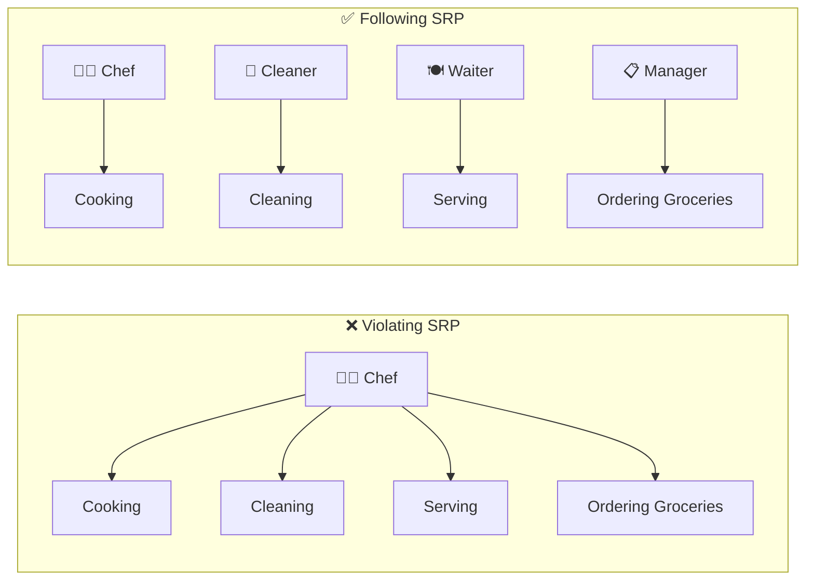
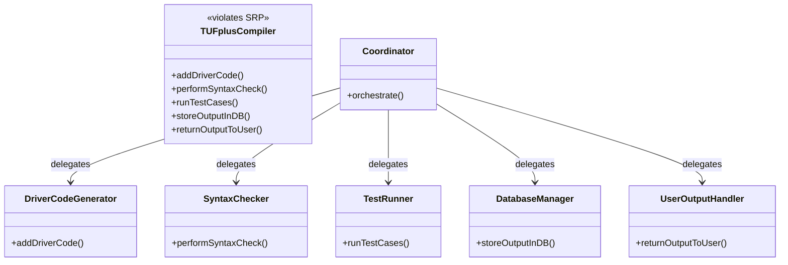

# Single Responsibility Principle (SRP)

> One of the five SOLID principles — a class should have only one job, one responsibility, and one purpose.

## What You'll Learn

By the end of this chapter, you'll understand:

- What the Single Responsibility Principle (SRP) is and where it fits in SOLID
- The definition and core idea behind SRP
- A real-life analogy to understand SRP intuitively
- A practical example using the TUF+ compiler breakdown
- The advantages of following SRP
- Common mistakes developers make when violating SRP
- How SRP applies beyond classes to methods, modules, and entire systems

---

## Introduction

There is a set of five principles for writing clean, scalable, maintainable object-oriented code. These principles are known as **SOLID principles**. The **S** in SOLID stands for **Single Responsibility Principle**.

---

## Definition

A class should have only **one reason to change**. In other words, a class should only have one job, one responsibility, and one purpose.

If a class takes more than one responsibility, it becomes **coupled**. This means that if one responsibility changes, the other responsibilities may also be affected, leading to a ripple effect of changes throughout the codebase.

---

## Real-Life Analogy

Imagine a chef who is responsible for cooking, cleaning, serving food, and ordering groceries. If the chef is busy cleaning, they can't focus on cooking, and the quality of the food may suffer.

Instead, different people should handle each task:
- One person **cooks** (chef)
- Another **cleans** (cleaner)
- A third **serves** (waiter)
- Another **orders groceries** (manager)

This way, each person can focus on their specific responsibility, leading to better results overall.

---

## Significance of SRP

Let us understand this with the example of a **TUF+ compiler**. Currently, the TUF+ compiler does the following things:

- Adds driver code
- Performs syntax check
- Runs code with already fed test cases
- Stores the output in Database
- Returns the necessary output to the user

Now, implementing all the above functionalities in a single `TUFplusCompiler` class would **violate the Single Responsibility Principle (SRP)**.

Instead, we can break it down into smaller classes, each with a single responsibility:

- `DriverCodeGenerator` — Responsible for adding driver code.
- `SyntaxChecker` — Responsible for performing syntax checks.
- `TestRunner` — Responsible for running code with test cases.
- `DatabaseManager` — Responsible for storing output in the database.
- `UserOutputHandler` — Responsible for returning output to the user.

Another class named `Coordinator` can be added to coordinate between all these classes/modules.

By following the Single Responsibility Principle, we can make the code more modular, easier to maintain, and less prone to bugs. Each class can be modified or replaced independently without affecting the others.

---

## Advantages of SRP

- **Improved Maintainability:** Changes in one part of the system won't affect other parts, making it easier to maintain and update.
- **Enhanced Readability:** Smaller, focused classes are easier to read and understand.
- **Better Reusability:** Classes with a single responsibility can be reused in different contexts without bringing unnecessary dependencies.
- **Facilitates Testing:** Smaller classes are easier to test, as they have fewer dependencies and responsibilities.
- **Lower Risk in Changes:** Since each class handles only one concern, changes made to it are less likely to cause unintended side effects in other parts of the system.

---

## Common Mistakes When Violating SRP

There are a few common mistakes that developers make when violating the Single Responsibility Principle (SRP). Here are some examples:

- **Mixing Database Logic with Business Logic:** Putting both data access (e.g., SQL, JDBC) and core business rules in the same class. This makes it hard to change the database layer without affecting business logic.
- **Coupling UI Code with Business Logic:** Embedding application logic directly in the UI layer. This makes it tedious to change the UI without affecting the underlying logic.

---

## Note

> [!NOTE]
> An important question to ask is: "Is SRP just for classes?"
>
> The answer is **no**. SRP can be applied to methods, modules, microservices, and even entire systems. The key is to ensure that each component has a single responsibility and that changes in one area do not affect others unnecessarily.
>
> Hence, SRP is not just for classes. It's a **mindset** you can apply from the smallest method to the largest system design.

---

## Summary

| Concept | Key Takeaway |
| :--- | :--- |
| **Definition** | A class should have only one reason to change — one job, one responsibility. |
| **Coupling Problem** | Multiple responsibilities in one class create tight coupling and ripple-effect bugs. |
| **Real-Life Analogy** | Like a restaurant — chef cooks, waiter serves, cleaner cleans. No one does everything. |
| **TUF+ Example** | Split `TUFplusCompiler` into `SyntaxChecker`, `TestRunner`, `DatabaseManager`, etc. |
| **Advantages** | Better maintainability, readability, reusability, testability, and lower change risk. |
| **Common Mistakes** | Mixing DB logic with business logic, coupling UI code with application logic. |
| **Scope of SRP** | Applies to methods, modules, microservices, and entire systems — not just classes. |
