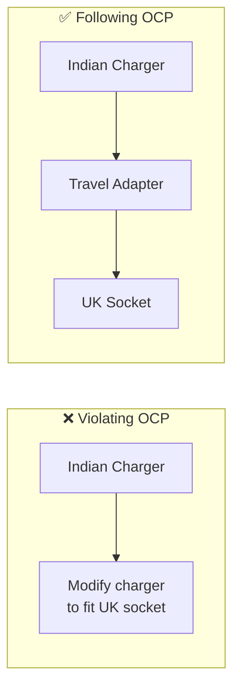
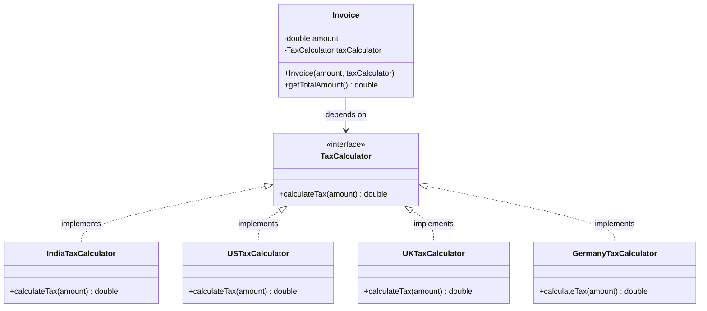
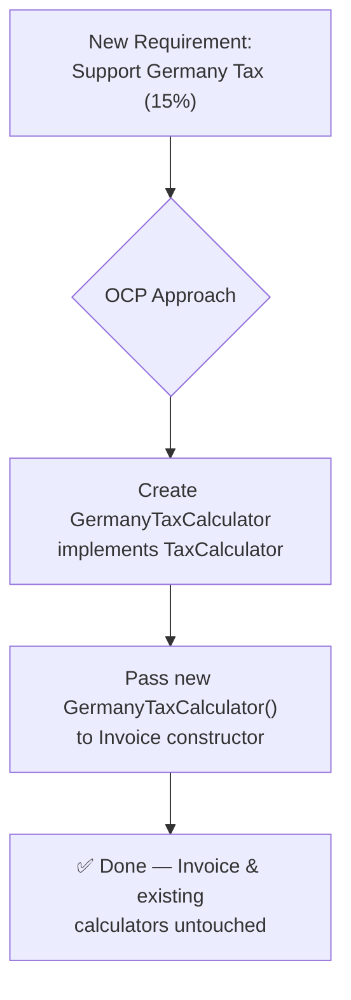

# (OCP)

> Software entities should be open for extension but closed for modification — extend behavior without touching existing, stable code.

## What You'll Learn

By the end of this chapter, you'll understand:

- What the Open Closed Principle (OCP) is and where it fits in SOLID
- The definition and core idea behind OCP
- A real-life analogy using power adapters
- A real-world example using region-based tax calculation in an Invoicing System
- Bad design that violates OCP vs. good design that follows OCP
- How to extend the system for new regions without modifying existing code
- When to apply OCP and when not to
- Common misconceptions about OCP

---

## Introduction

There is a set of five principles for writing clean, scalable, maintainable object-oriented code. These principles are known as **SOLID principles**. The **O** in SOLID stands for **Open Closed Principle**.

---

## Definition

As per OCP, software entities (classes, modules, functions, etc.) should be **open for extension**, but **closed for modification**.

This means that the behavior of a module can be extended without modifying its source code. The goal is to reduce the risk of breaking existing functionality when requirements change.

---

## Real-Life Analogy

Let's understand the application of OCP in real-life with the help of **power adapters**. Imagine you travel from India to the UK. Your Indian charger doesn't fit into UK power sockets. Instead of buying a new charger, you use a travel adapter.

- The adapter **extends** your existing charger's usability (now works in UK).
- You did **not modify** the charger itself.

Similarly, in code, OCP encourages adding new functionality via extension, rather than altering existing, stable code.



---

## Real-World Example

Let's now use **region-based tax calculation** (e.g., India, US, UK) in an **Invoicing System** to explain the Open/Closed Principle. As an invoicing system grows, it must handle tax rules for different regions (the values might not be accurate):

- **India:** GST 18%
- **US:** Sales Tax 8%
- **UK:** VAT 12%

New regions may be added over time.

---

### Bad Design - Violating OCP

```java
class InvoiceProcessor {
    public double calculateTotal(String region, double amount) {
        if (region.equalsIgnoreCase("India")) {
            return amount + amount * 0.18;
        } else if (region.equalsIgnoreCase("US")) {
            return amount + amount * 0.08;
        } else if (region.equalsIgnoreCase("UK")) {
            return amount + amount * 0.12;
        } else {
            return amount; // No tax for unknown region
        }
    }
}
```

The above code is considered a bad practice because:

- Adding a new region (e.g., Germany) requires **modifying this method**.
- You risk **breaking existing logic** while adding new functionality.
- Hard to test, maintain, or scale.
- Violates the Open/Closed Principle.

---

### Good Design - Follows OCP

```java
// Tax strategy Interface
interface TaxCalculator {
    double calculateTax(double amount);
}

// Implementing Region-Specific Tax Calculators
class IndiaTaxCalculator implements TaxCalculator {
    public double calculateTax(double amount) {
        return amount * 0.18; // GST
    }
}
class USTaxCalculator implements TaxCalculator {
    public double calculateTax(double amount) {
        return amount * 0.08; // Sales Tax
    }
}
class UKTaxCalculator implements TaxCalculator {
    public double calculateTax(double amount) {
        return amount * 0.12; // VAT
    }
}

// Using dependency Injection
class Invoice {
    private double amount;
    private TaxCalculator taxCalculator;

    public Invoice(double amount, TaxCalculator taxCalculator) {
        this.amount = amount;
        this.taxCalculator = taxCalculator;
    }

    public double getTotalAmount() {
        return amount + taxCalculator.calculateTax(amount);
    }
}

// Main class
class Main {
    public static void main(String[] args) {
        double amount = 1000.0;

        Invoice indiaInvoice = new Invoice(amount, new IndiaTaxCalculator());
        System.out.println("Total (India): ₹" + indiaInvoice.getTotalAmount());

        Invoice usInvoice = new Invoice(amount, new USTaxCalculator());
        System.out.println("Total (US): $" + usInvoice.getTotalAmount());

        Invoice ukInvoice = new Invoice(amount, new UKTaxCalculator());
        System.out.println("Total (UK): £" + ukInvoice.getTotalAmount());
    }
}
```



**Explanation:**

1. **Define a Tax Strategy Interface:** The `TaxCalculator` interface defines a contract for all region-specific tax classes to follow, enabling polymorphism and extension.
2. **Implement Region-Specific Tax Calculators:** The `IndiaTaxCalculator`, `USTaxCalculator`, and `UKTaxCalculator` classes provide concrete implementations of the `TaxCalculator` interface for each region, encapsulating tax logic.
3. **Using Dependency Injection:** The `Invoice` class is decoupled from specific tax types by receiving a `TaxCalculator` from the outside (this is called Dependency Injection).
4. **Main Running Code:** In main function, we create the appropriate tax calculator and inject it into the `Invoice` class, making the system easily extensible for new regions.

---

### Extending for a New Region (Germany)

Assume that now, we want to support Germany with 15% tax. In such a case, a simple code snippet can be introduced in the file:

```java
class GermanyTaxCalculator implements TaxCalculator {
    public double calculateTax(double amount) {
        return amount * 0.15;
    }
}
```

And just pass `new GermanyTaxCalculator()` to `Invoice`. **No modification to `Invoice` or main logic is needed.**



---

## When to Apply OCP?

The Open/Closed Principle is especially useful in the following scenarios:

- When a module is expected to change or evolve due to shifting business or technical requirements.
- When there is a need to extend functionality without modifying existing, tested code.
- When developing frameworks, plugins, or extensible systems such as billing engines, tax calculators, or UI components.
- When aiming to safeguard stable, production-ready modules from regression caused by direct changes.
- When a class is becoming a **God Class** — handling too many responsibilities or branching logic — which signals a need to extract behaviors into separate, extendable components.

That said, applying the principle preemptively without clear extension needs can introduce unnecessary abstraction and complexity. It is generally most effective when applied in response to observed patterns of change or a well-understood need for scalability.

---

## Common Misconceptions about OCP

There are a few misconceptions that revolve around OCP. Let's talk about it, one by one:

**"Open/Closed means code should never be changed again."**
This interpretation overlooks the intent of OCP. The principle emphasizes avoiding changes to core logic while allowing behavior to be extended safely.

**"OCP leads to too many classes, so it's overkill."**
It's true that applying OCP often results in more classes or interfaces. However, this trade-off typically improves modularity, testability, and maintainability, especially in systems expected to evolve.

**"OCP makes the code harder to read."**
In small or short-lived projects, added abstraction can feel unnecessary. But in systems with complex behavior or frequent changes, well-structured extensibility can actually improve clarity by separating concerns and reducing conditional logic.

**"OCP should always be applied upfront."**
Applying OCP preemptively can result in unnecessary abstraction and complexity. It is often more effective when used in response to emerging patterns of change.

**"Refactoring contradicts OCP."**
Refactoring is not a violation of OCP. On the contrary, it is frequently a step toward making code compliant with OCP by improving its structure and extensibility.

**"OCP makes retesting legacy code unnecessary."**
While the principle aims to reduce the need for modifying and retesting stable components, new extensions still require thorough testing to ensure correctness and integration.

---

## Summary

| Concept | Key Takeaway |
| :--- | :--- |
| **Definition** | Software entities should be open for extension but closed for modification. |
| **Core Goal** | Extend behavior without touching existing, stable, tested code. |
| **Real-Life Analogy** | A travel adapter extends a charger's usability without modifying the charger. |
| **Bad Design** | A single method with chained `if-else` for each region — breaks OCP on every new region. |
| **Good Design** | A `TaxCalculator` interface with region-specific implementations + `Invoice` using Dependency Injection. |
| **Extending Safely** | Adding Germany tax = one new class, zero changes to `Invoice` or existing calculators. |
| **When to Apply** | Evolving modules, extensible systems, God Class refactoring, protecting production-ready code. |
| **Common Mistake** | Applying OCP upfront everywhere — use it in response to observed patterns of change. |
