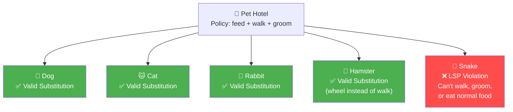
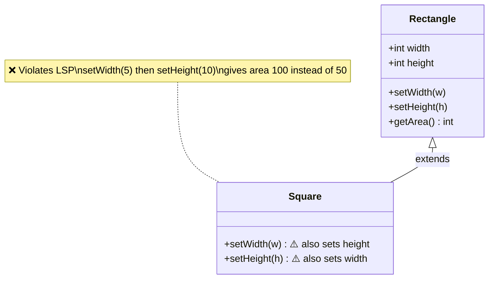
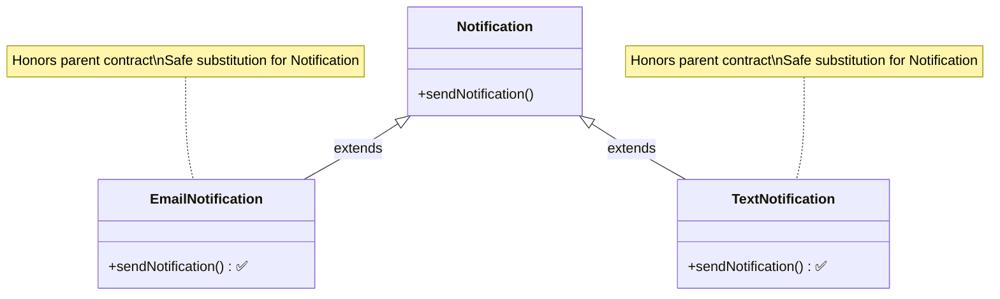

# Liskov Substitution Principle (LSP)

> Any subclass should be substitutable for its parent class without breaking the functionality of the program.

## What You'll Learn

By the end of this chapter, you'll understand:

- What the Liskov Substitution Principle (LSP) is and where it fits in SOLID
- The formal definition of LSP
- A real-life analogy using a pet hotel to understand substitution intuitively
- A classic LSP violation: the Rectangle-Square problem
- How LSP enables safe system extension: the Notification system example
- Why LSP matters and what goes wrong when it is violated
- How to spot LSP violations in your code
- Key principles to follow to avoid LSP violations

---

## Introduction

There is a set of five principles for writing clean, scalable, maintainable object-oriented code. These principles are known as **SOLID principles**. The **L** in SOLID stands for **Liskov Substitution Principle**.

---

## Definition

If **S** is a subtype of **T**, then objects of type **T** may be replaced with objects of type **S** without altering the correctness of the program.

This means that any subclass should be substitutable for its parent class without breaking the functionality.

Think of it like this:
- If you write code using a parent class (say `Shape`), and later swap in a child class (like `Circle`), the code should still work without errors or unexpected behavior.
- If the subclass changes behavior in a way that breaks expectations, it **violates LSP**.

---

## Real-Life Analogy

Imagine you run a **pet hotel**, and you have a general policy:

> *"Any pet staying here must be able to be fed, walked, and groomed."*

So you design your hotel to handle pets — and you've had dogs, cats, and rabbits as guests, and things work fine.

### The Problem

Assume someone brings in a **pet snake**. Here are the issues:
- You try to **walk** it. Can't.
- You try to **groom** it. Doesn't make sense.
- You offer **pet food**. Snake needs live mice.

Suddenly, your normal pet hotel process breaks. Your system expected all pets to behave like dogs or cats, but this snake breaks the assumptions. This creates an **LSP Violation**.

### A Valid Substitution

If instead someone brings in a **pet hamster** — it still eats food, needs care, and maybe doesn't walk outside, but it still fits within the expected "pet" behavior. You just make a minor adjustment (like putting it in a wheel instead of walking it). Still fine — no big surprises.

### Understanding

The pet hotel needs to trust that any "pet" will behave in expected ways. If a new pet completely changes the rules, the whole system becomes fragile.

That's exactly what the **Liskov Substitution Principle** protects us from in software — making sure substituting one thing for another doesn't break the expected behavior.



---

## Example: LSP Violation

Let's illustrate this with the classic **Rectangle-Square** example, which is a famous LSP violation case. Consider the code given below:

```java
// Rectangle class
class Rectangle {
    int width, height;

    void setWidth(int w) { width = w; }
    void setHeight(int h) { height = h; }
    int getArea() { return width * height; }
}

// Square class extending the Rectangle class
class Square extends Rectangle {
    @Override
    void setWidth(int w) {
        width = w;
        height = w; // makes it a square
    }

    @Override
    void setHeight(int h) {
        height = h;
        width = h; // makes it a square
    }
}

// Main class
class Main {
    public static void main(String args[]) {
        // Replacing object of Rectangle class with Square class
        Rectangle r = new Square();

        // Method call to print the area of the rectangle
        printArea(r);
    }

    // Method to print the area of the given rectangle object
    private static void printArea(Rectangle r) {
        r.setWidth(5);
        r.setHeight(10);
        System.out.println(r.getArea()); // Expected: 50 but Actual: 100
    }
}
```

In the above code:
- `Square` class is a subclass of `Rectangle` class.
- The `printArea()` function takes a `Rectangle` object as an argument and prints its area.
- To demonstrate the violation of LSP, the object of `Rectangle` class is replaced with the object of `Square` class.

### Violation

| | Value |
| :--- | :--- |
| **Expected Output** | 50 |
| **Actual Output** | 100 (since both the width and height became 10) |

So, the `Square` violates LSP because it changes the behavior of `setWidth` and `setHeight`, breaking the assumptions of the parent class.



---

## Need of LSP

Consider the example of a **Notification system**:

```java
// Notification class
class Notification {
    public void sendNotification() {
        System.out.println("Notification sent");
    }
}

// Main class
class Main {
    public static void main(String args[]) {
        Notification notification = new Notification();
        notification.sendNotification();
    }
}
```

Assume we wish to introduce some new type of notifications, say **Email Notification** or **Text Notification**.

In such a case, we can create a new class for each type of notification, and we can easily extend the system without breaking existing code using the Liskov Substitution Principle.

```java
// Notification class
class Notification {
    public void sendNotification() {
        System.out.println("Notification sent");
    }
}

// Subclass of Notification class for Email Notification
class EmailNotification extends Notification {
    @Override
    public void sendNotification() {
        System.out.println("Email Notification sent");
    }
}

// Subclass of Notification class for Text Notification
class TextNotification extends Notification {
    @Override
    public void sendNotification() {
        System.out.println("Text Notification sent");
    }
}

// Main class
class Main {
    public static void main(String args[]) {
        /* Replaced the Notification class object
        with one of its subclass' objects */
        Notification notification = new EmailNotification();

        notification.sendNotification();
    }
}
```

Here, the only change needed for introducing two different types of the notification system is to create two subclasses of the `Notification` class with overridden `sendNotification()` method. The main class can remain unchanged. The only change needed in the main method is the declaration of notification object.

This is the power of LSP. It allows us to extend our system without breaking existing code.



---

## Why Does LSP Matter?

When LSP is violated, the code becomes:

- **Unpredictable:** Code relying on base class assumptions will break with certain subclasses.
- **Hard to Maintain:** Adding new subclasses requires rechecking all usages.
- **Bug-Prone:** Runtime errors, wrong outputs, or inconsistent behavior.
- **Less Reusable:** Substituting child objects becomes dangerous.
- **Tight Coupling:** Client code ends up getting tightly coupled to specific types, making it less maintainable.

Hence, to avoid these problems while working on a huge codebase, it is recommended to follow the Liskov Substitution Principle (LSP) (wherever possible).

---

## How to Spot LSP Violations?

To spot LSP violations, ask yourself these questions:

- Does the subclass override methods in a way that **changes meaning or assumptions**?
- Can I replace the base class with the subclass everywhere **without changing expected behavior or breaking correctness**?
- Does the subclass **throw unexpected exceptions** or return wrong values?
- Does the subclass **weaken any preconditions or strengthen postconditions**?

If the answer to any of these questions is "yes", there might be a LSP violation in the code.

---

## Key Principles to Follow

There are some key principles to follow to avoid LSP violations. These are:

- Subclasses should **honor the contract** (expectations) of the parent class.
- Avoid overriding methods in a way that **changes behavior drastically**.
- Prefer **composition over inheritance** when possible.
- Think in terms of **interfaces and behavioral compatibility**.
- Subclass should only **extend**, not **restrict** behavior.

---

## Summary

| Concept | Key Takeaway |
| :--- | :--- |
| **Definition** | Objects of a subtype must be replaceable for their supertype without breaking correctness. |
| **Pet Hotel Analogy** | A snake breaks pet hotel assumptions (can't walk/groom/eat normal food) — just like a bad subclass. |
| **Rectangle-Square Violation** | `Square` overrides `setWidth`/`setHeight` in a way that breaks `printArea()` — expected 50, got 100. |
| **Notification Example** | `EmailNotification` and `TextNotification` safely substitute `Notification` without breaking anything. |
| **Why It Matters** | Violations make code unpredictable, hard to maintain, bug-prone, and tightly coupled. |
| **Spotting Violations** | Check if subclass overrides change meaning, throw unexpected exceptions, or weaken contracts. |
| **Key Principles** | Honor parent contracts, prefer composition, think in interfaces, only extend — never restrict. |
