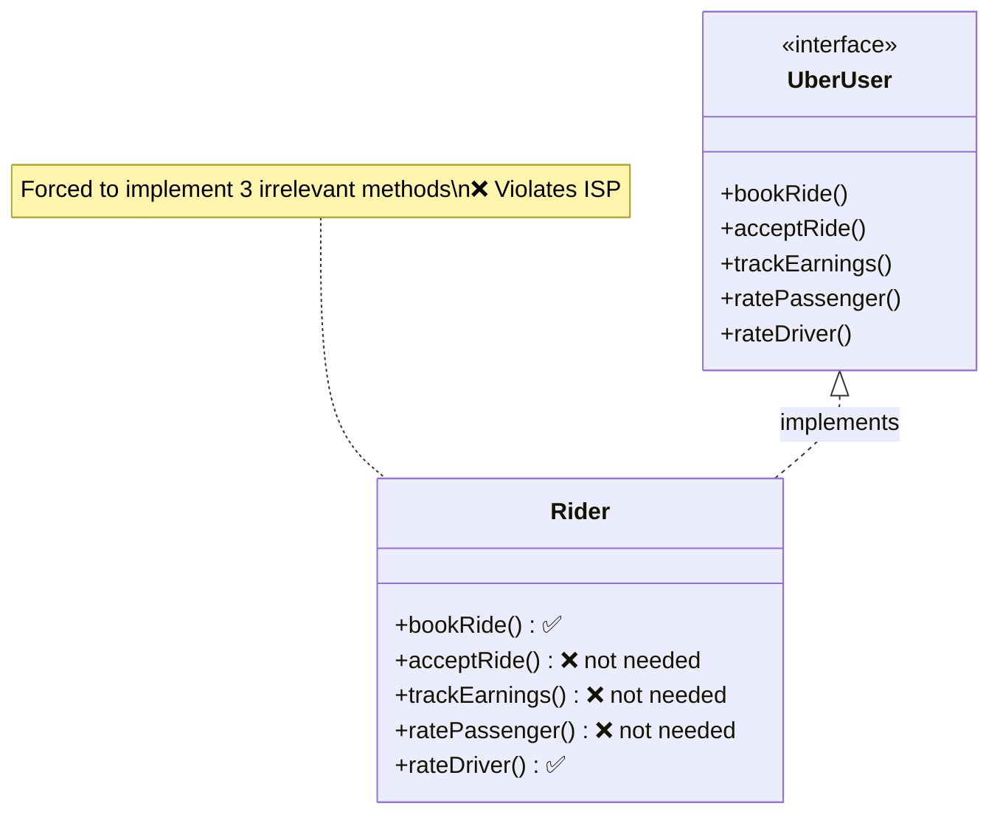
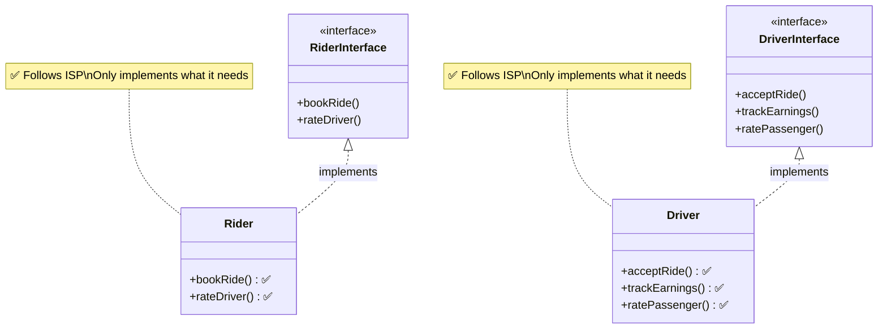

# Interface Segregation Principle (ISP)

> Don't force a class to depend on methods it does not use — design slim, purpose-specific interfaces tailored to each client.

## What You'll Learn

By the end of this chapter, you'll understand:

- What the Interface Segregation Principle (ISP) is and where it fits in SOLID
- The definition and core idea behind ISP
- A relatable Uber analogy to understand why fat interfaces are a problem
- A bad interface design that violates ISP vs. a good design that follows ISP
- The benefits of applying ISP
- When to apply ISP in your codebase

> [!NOTE]
> Before starting with ISP, it is recommended to understand what interfaces are and how they work. Refer to the [Interfaces](https://takeuforward.org/plus/oops/advance-oops-features/interfaces) article for a better understanding.

---

## Introduction

There is a set of five principles for writing clean, scalable, maintainable object-oriented code. These principles are known as **SOLID principles**. The **I** in SOLID stands for **Interface Segregation Principle**.

---

## Definition

**"Don't force a class to depend on methods it does not use."**

---

## Understanding

Suppose you order an Uber. You're just a rider — you only care about **booking rides**, **tracking the driver**, and **paying**. You don't care about picking up passengers, verifying driver's licenses, or managing earnings — that's for drivers!

But what if the app gave you one massive interface with everything — rider features and driver features? It would be confusing, right?

That's exactly what ISP helps prevent in software.

---

## Uber Example: Applying ISP

Let's say you're designing Uber's app interfaces.

### Bad Interface Design (Violates ISP)

```java
interface UberUser {
    void bookRide();
    void acceptRide();
    void trackEarnings();
    void ratePassenger();
    void rateDriver();
}
```

Using such an interface would force riders to implement methods they don't need, like `acceptRide()` and `trackEarnings()`. For instance:

```java
class Rider implements UberUser {
    public void bookRide()      { /* yes */ }
    public void acceptRide()    { /* not needed */ }
    public void trackEarnings() { /* not needed */ }
    public void ratePassenger() { /* not needed */ }
    public void rateDriver()    { /* yes */ }
}
```

This is extremely messy. `Rider` is forced to implement stuff it never uses!



---

### Good Interface Design (Follows ISP)

A better interface design would separate the concerns:

```java
interface RiderInterface {
    void bookRide();
    void rateDriver();
}

interface DriverInterface {
    void acceptRide();
    void trackEarnings();
    void ratePassenger();
}
```

Now, each class only implements what it actually needs:

```java
class Rider implements RiderInterface {
    public void bookRide()   { /* yes */ }
    public void rateDriver() { /* yes */ }
}

class Driver implements DriverInterface {
    public void acceptRide()    { /* yes */ }
    public void trackEarnings() { /* yes */ }
    public void ratePassenger() { /* yes */ }
}
```

Now, each class has exactly what it needs — no more, no less. Thus, following the ISP keeps the code clean and easy to maintain.



---

## Benefits of Using ISP

There are several benefits to using the Interface Segregation Principle (ISP) in software design. Here are some of the key advantages:

- **Cleaner Codebase:** Classes are not bloated with irrelevant methods.
- **Better Flexibility:** Easier to change one part without affecting others.
- **High Maintainability:** Smaller interfaces are easier to understand and test.
- **Fewer Bugs:** Less chance of someone accidentally using or overriding a method they don't need.
- **Scalability:** As your app grows, adding new roles (like delivery partners in Uber Eats) becomes easier.

---

## When to Apply ISP

The Interface Segregation Principle (ISP) is a valuable guideline in software design, but it should be applied judiciously. Here are some scenarios where you should consider applying ISP:

- You see a class implementing methods it doesn't use.
- An interface starts to grow too big and is being used by multiple types of classes.
- Adding a new feature requires modifying several unrelated classes.
- You're working with APIs or plugins where exposing only relevant methods improves usability.

---

## Conclusion

The Interface Segregation Principle is all about designing interfaces that are tailored to the needs of each client — just like Uber doesn't show driver options to passengers. This leads to modular, understandable, and future-proof code.

> **Remember:** Fat interfaces are bad. Slim, purpose-specific interfaces are good.

---

## Summary

| Concept | Key Takeaway |
| :--- | :--- |
| **Definition** | Don't force a class to implement methods it doesn't use. |
| **Uber Analogy** | Riders shouldn't see driver options; one massive `UberUser` interface forces them to. |
| **Bad Design** | One fat `UberUser` interface forces `Rider` to implement `acceptRide()` and `trackEarnings()`. |
| **Good Design** | Split into `RiderInterface` and `DriverInterface` — each class implements only what it needs. |
| **Cleaner Code** | Smaller interfaces reduce bloat, bugs, and accidental method overrides. |
| **Scalability** | Adding new roles (e.g., Uber Eats delivery partner) is easy with segregated interfaces. |
| **When to Apply** | When classes implement unused methods, or interfaces grow too large and general. |
