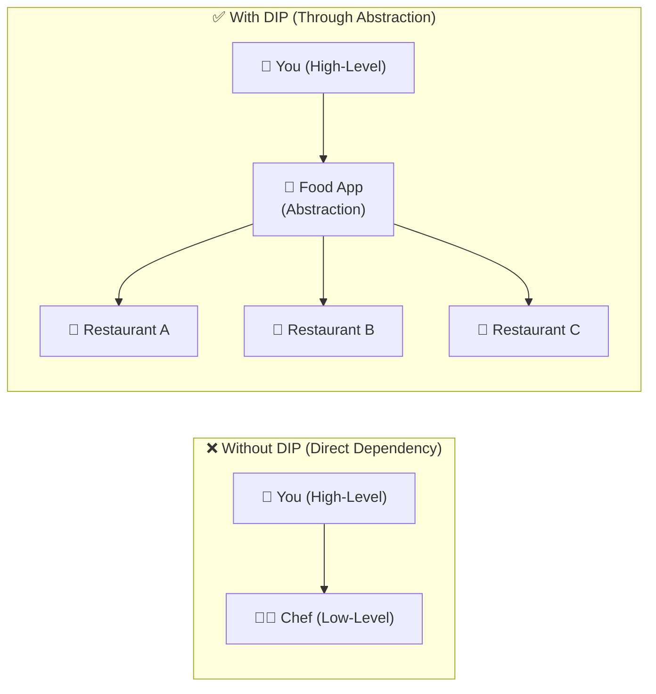
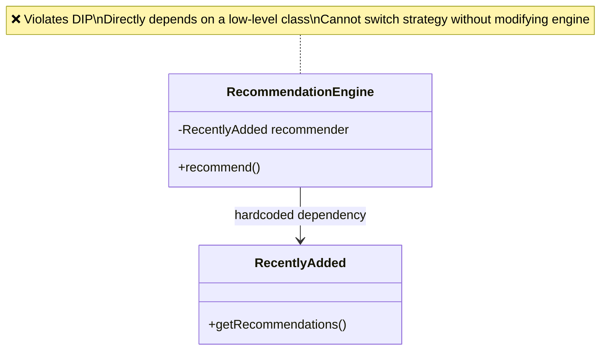
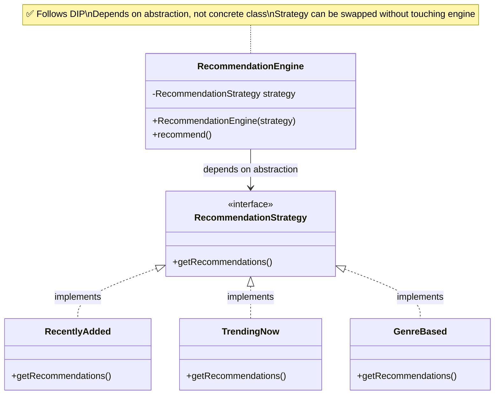
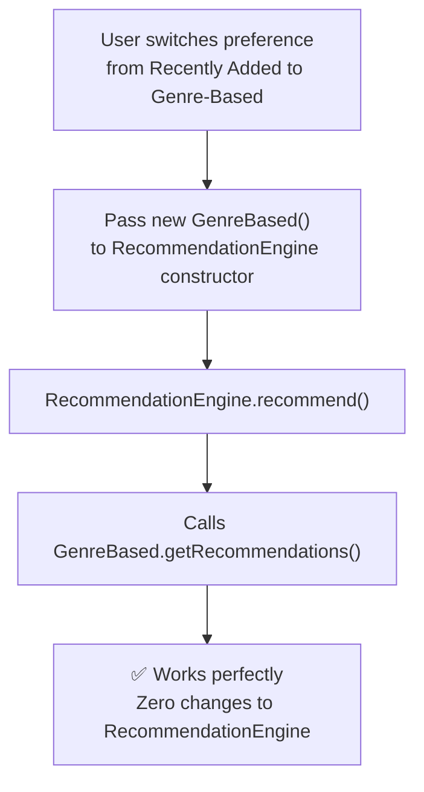

# (DIP)

> High-level modules should not depend on low-level modules — both should depend on abstractions, making code flexible, testable, and easy to maintain.

## What You'll Learn

By the end of this chapter, you'll understand:

- What High-Level and Low-Level modules are
- What the Dependency Inversion Principle (DIP) is and where it fits in SOLID
- The definition and core idea behind DIP
- A real-life analogy using a food delivery app
- A Netflix Recommendation Engine example: tightly coupled code vs. DIP-compliant code
- How to switch strategies at runtime without modifying the high-level module
- The benefits of applying DIP

---

## Pre-requisites

To better understand the DIP, it is recommended to have a basic understanding of the following terms:

- **High-Level Modules:** The parts of your code that contain the core logic — the brains of your application. They make big decisions and coordinate how different features work together.
  - *Example:* CEO (makes decisions, plans strategies).

- **Low-Level Modules:** The ones that handle the details — like talking to a database, making API calls, reading files, or providing data. They support the high-level logic by doing the grunt work.
  - *Example:* Employees (do the actual implementation, logistics, and execution).

- **[Abstraction](https://takeuforward.org/plus/oops/advance-oops-features/abstraction)** — An interface or abstract class that acts as a contract between high-level and low-level modules.

---

## Introduction

There is a set of five principles for writing clean, scalable, maintainable object-oriented code. These principles are known as **SOLID principles**. The **D** in SOLID stands for **Dependency Inversion Principle**.

---

## Definition

> *"High-level modules should not depend on low-level modules. Both should depend on abstractions. Abstractions should not depend on details. Details should depend on abstractions."*

In simpler words: rather than high-level classes controlling and depending on the details of lower-level ones, both should rely on interfaces or abstract classes. This makes your code flexible, testable, and easier to maintain.

---

## Real-Life Analogy

Let's say you're hungry and you want pizza. You use a food delivery app, and not contact the chef directly.

- **You (user)** → Use → **Food App (Abstraction)**
- **Food App** → Deals with → **Restaurant/Chef (Implementation)**

You don't care which chef will make the pizza, or how the pizza is made, or who is your delivery partner — you just want it delivered from your selected restaurant on time. Here:

- **You** = High-level module
- **Food App Interface** = Abstraction
- **Restaurant** = Low-level module

You're not directly dependent on any specific details, but only on the food delivery system (abstraction).

This is what exactly DIP suggests while writing code with industry standards — high-level modules should not depend on low-level modules. Instead, both should depend on abstractions.



---

## Example: Netflix Recommendation Engine

Let's illustrate the Dependency Inversion Principle with a simple example of a **Netflix recommendation engine**.

Netflix uses various recommendation strategies:
- **Recently Added:** Shows/movies recently added to the catalog
- **Trending Now:** Based on what's currently popular
- **Genre-Based:** What you've watched and liked before

Now let's see how Netflix might (badly) and should (correctly) implement this using the Dependency Inversion Principle.

---

### Without DIP - Tightly Coupled Code

```java
// Class implementing the recommendations based on recently added
class RecentlyAdded {
    // Method to get the recommendations
    public void getRecommendations() {
        System.out.println("Showing recently added content...");
    }
}

// Class implementing the overall Recommendation Engine
class RecommendationEngine {
    private RecentlyAdded recommender = new RecentlyAdded();

    public void recommend() {
        recommender.getRecommendations();
    }
}
```

Issues in the above code:

- `RecommendationEngine` is tightly coupled to `RecentlyAdded`.
- If we want to switch to `TrendingNow` or `GenreBased` strategies, we have to **modify the engine**.



---

### With DIP - Using Abstraction

```java
// Interface provided for classes to implement different recommendation strategies
interface RecommendationStrategy {
    void getRecommendations();
}

// Class implementing recommendations based on recently added
class RecentlyAdded implements RecommendationStrategy {
    public void getRecommendations() {
        System.out.println("Showing recently added content...");
    }
}

// Class implementing recommendations based on trending now
class TrendingNow implements RecommendationStrategy {
    public void getRecommendations() {
        System.out.println("Showing trending content...");
    }
}

// Class implementing recommendations based on Genre
class GenreBased implements RecommendationStrategy {
    public void getRecommendations() {
        System.out.println("Showing content based on your favorite genres...");
    }
}

// Class implementing the Recommendation Engine (High-level module)
class RecommendationEngine {
    private RecommendationStrategy strategy;

    public RecommendationEngine(RecommendationStrategy strategy) {
        this.strategy = strategy;
    }

    public void recommend() {
        strategy.getRecommendations();
    }
}

// Main driver code
class Main {
    public static void main(String[] args) {
        RecommendationStrategy strategy = new TrendingNow(); // could also be RecentlyAdded or GenreBased
        RecommendationEngine engine = new RecommendationEngine(strategy);
        engine.recommend();
    }
}
```

Here:

- `RecommendationEngine` doesn't care how recommendations are made — it just needs a recommendation.
- The strategies (`TrendingNow`, `RecentlyAdded`, `GenreBased`) can be switched or upgraded anytime, **without changing the engine**.



---

### Easier Switching between Strategies at Runtime

Let's say a user switches from "Recently Added" to "Genre-Based" dynamically:

```java
// Interface provided for classes to implement different recommendation strategies
interface RecommendationStrategy {
    void getRecommendations();
}

// Class implementing recommendations based on recently added
class RecentlyAdded implements RecommendationStrategy {
    public void getRecommendations() {
        System.out.println("Showing recently added content...");
    }
}

// Class implementing recommendations based on trending now
class TrendingNow implements RecommendationStrategy {
    public void getRecommendations() {
        System.out.println("Showing trending content...");
    }
}

// Class implementing recommendations based on Genre
class GenreBased implements RecommendationStrategy {
    public void getRecommendations() {
        System.out.println("Showing content based on your favorite genres...");
    }
}

// Class implementing the Recommendation Engine (High-level module)
class RecommendationEngine {
    private RecommendationStrategy strategy;

    public RecommendationEngine(RecommendationStrategy strategy) {
        this.strategy = strategy;
    }

    public void recommend() {
        strategy.getRecommendations();
    }
}

// Main driver code
class Main {
    public static void main(String[] args) {
        RecommendationEngine engine = new RecommendationEngine(new GenreBased());
        engine.recommend();
    }
}
```

No changes required in `RecommendationEngine` class — just pass a new strategy. That's the power of Dependency Inversion Principle used in designing the Recommendation Strategy.



---

## Benefits of Using DIP

There are various benefits to using the Dependency Inversion Principle (DIP) in software design. Here are some of the key advantages:

- **Flexibility:** Easily swap out implementations without modifying high-level code.
- **Testability:** You can mock or stub the abstractions during testing.
- **Reusability:** Code becomes reusable since it's not tightly bound to one specific implementation.
- **Maintainability:** Makes it easier to change one part of the system without affecting others.
- **Scalability:** You can scale or upgrade parts of your codebase without a massive rewrite.

---

## Summary

| Concept | Key Takeaway |
| :--- | :--- |
| **Definition** | High-level and low-level modules should both depend on abstractions, not on each other. |
| **High-Level Module** | Contains core logic and decision-making (e.g., `RecommendationEngine`). |
| **Low-Level Module** | Handles implementation details (e.g., `RecentlyAdded`, `TrendingNow`, `GenreBased`). |
| **Abstraction** | The interface or abstract class both sides depend on (e.g., `RecommendationStrategy`). |
| **Food App Analogy** | You depend on the food app (abstraction), not directly on the chef (low-level). |
| **Without DIP** | `RecommendationEngine` hardcodes `RecentlyAdded` — impossible to swap without modifying engine. |
| **With DIP** | `RecommendationEngine` depends on `RecommendationStrategy` — any strategy can be injected freely. |
| **Runtime Switching** | Pass `new GenreBased()` to the engine — no engine code changes needed. |
| **Key Benefits** | Flexibility, testability, reusability, maintainability, scalability. |
