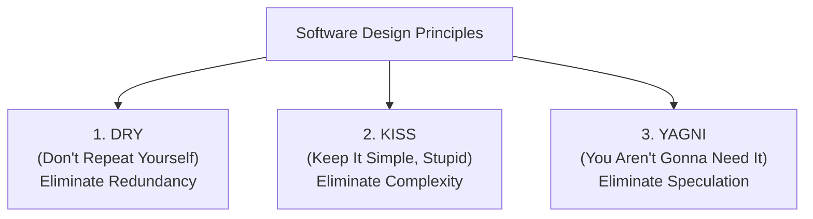
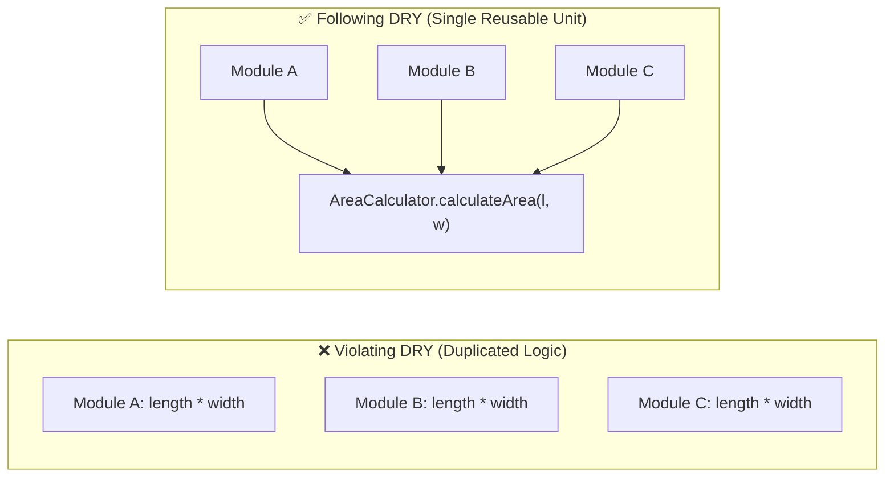
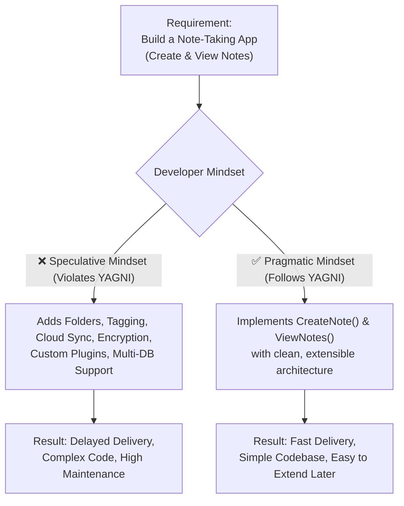

# Software Design Principles (DRY, KISS, YAGNI)

> Core foundational guidelines for writing clean, maintainable, and pragmatic code across High-Level and Low-Level Design.

## What You'll Learn

By the end of this chapter, you'll understand:

- What Software Design Principles are and why they matter in software engineering
- The **DRY (Don't Repeat Yourself)** principle, its practical implementation, and when **NOT** to use it
- The **KISS (Keep It Simple, Stupid)** principle, identifying overengineering, and writing clean solutions
- The **YAGNI (You Aren't Gonna Need It)** principle, preventing premature feature bloat, and its practical exceptions
- Side-by-side Java before/after code comparisons for DRY, KISS, and YAGNI
- Visual workflows and comparison matrix of DRY, KISS, and YAGNI

---

## What Are Software Design Principles?

**Software design principles** are fundamental guidelines and best practices that help software engineers build systems that are easy to understand, maintain, test, and extend. 

These principles can be applied at both stages of system design:
- **High-Level Design (HLD):** Structuring microservices, API contracts, domain boundaries, and database schemas.
- **Low-Level Design (LLD):** Designing classes, methods, data structures, and algorithms.



The three cornerstone principles are **DRY**, **KISS**, and **YAGNI**.

---

## 1. DRY: Don't Repeat Yourself

### Principle Definition

> *"Every piece of knowledge must have a single, unambiguous, authoritative representation within a system."*  
> — Andy Hunt and Dave Thomas (*The Pragmatic Programmer*)

In simple terms: **Avoid duplication of logic, knowledge, or code.** 

Repeating code makes a software system fragile, error-prone, and difficult to maintain. When business logic changes, having duplicated logic forces developers to search for and update every single occurrence. Forgetting even one instance introduces bugs and inconsistencies.

### Importance of DRY
- **Reduces Redundancy:** Eliminates duplicate logic and reduces the total codebase size.
- **Easier Maintenance:** Modifying behavior requires changes in only one place.
- **Single Point of Truth / Change:** Bugs need to be fixed once rather than across multiple classes or methods.



---

### Code Example: DRY

#### Bad Code (Violates DRY)

In the following example, the logic for calculating the area of a rectangle is duplicated across multiple variables/methods:

```java
import java.util.*;

class Main {
    public static void main(String[] args) {
        // Calculation logic duplicated for rectangle 1
        int length1 = 10, width1 = 5;
        int area1 = length1 * width1;
        System.out.println("Area1: " + area1);

        // Calculation logic duplicated for rectangle 2
        int length2 = 8, width2 = 4;
        int area2 = length2 * width2;
        System.out.println("Area2: " + area2);
    }
}
```

*Problem:* If the calculation formula needs validation (e.g., ensuring dimensions are non-negative) or modification, changes must be made in every location where the calculation occurs.

---

#### Good Code (Refactored to Follow DRY)

We extract the calculation logic into a single authoritative method:

```java
import java.util.*;

class AreaCalculator {
    // Single, authoritative method for area calculation
    public static int calculateArea(int length, int width) {
        if (length < 0 || width < 0) {
            throw new IllegalArgumentException("Dimensions must be positive.");
        }
        return length * width;
    }
}

class Main {
    public static void main(String[] args) {
        int area1 = AreaCalculator.calculateArea(10, 5);
        int area2 = AreaCalculator.calculateArea(8, 4);

        System.out.println("Area1: " + area1);
        System.out.println("Area2: " + area2);
    }
}
```

*Benefit:* We created a single `calculateArea()` method. If validation or calculation rules change, we only modify it in one place.

---

### Applying DRY in Practice

1. **Identify Repetitive Code:** Spot duplicated calculations, validation rules, or algorithmic steps and replace them with a single reusable segment.
2. **Extract Common Functionality:** Group shared logic into reusable private helper methods, service classes, or utility classes.
3. **Leverage Libraries & Frameworks:** Utilize built-in standard library utilities (e.g., `Objects.requireNonNull()`, `Collections.sort()`, `Apache Commons`, `Guava`) rather than writing custom duplicate utilities.
4. **Refactor Regularly:** Periodically audit classes and abstraction layers to consolidate overlapping domain logic.

---

### When NOT to Use the DRY Principle

While DRY is powerful, dogmatically applying it everywhere can harm code quality. Avoid DRY in the following scenarios:

#### 1. Premature Abstraction
- Don't extract common code too early.
- At first glance, two blocks of code might look identical today, but they may represent distinct business concepts that will evolve in different directions tomorrow.
- Forcing them into a shared abstraction creates **tight, accidental coupling** between unrelated components.
- *Rule of Thumb:* Wait for the "Rule of Three" (see the pattern appear three times before abstracting).

#### 2. Performance-Critical Code
- Don't apply DRY to performance-sensitive code if it introduces unacceptable runtime overhead.
- In low-latency systems (e.g., game engines, high-frequency trading), duplicating a tight, low-level loop directly inside a method can be faster than dispatching method calls, indirection layers, or generic wrappers that prevent compiler optimizations like loop unrolling and function inlining.

#### 3. Sacrificing Readability
- If extracting repeated code introduces multiple layers of indirection, complex generics, or obscure inheritance hierarchies, **prefer clarity over DRYness**. Readable, slightly repetitive code is better than unreadable, ultra-clever abstractions.

#### 4. Legacy Codebases
- Avoid refactoring for DRY's sake in legacy code unless strictly necessary and backed by thorough test suites.
- Legacy systems often lack comprehensive tests and documentation; refactoring shared logic can introduce unintended behavioral regressions. Follow the *"leave it alone unless you must touch it"* principle.

---

## 2. KISS: Keep It Simple, Stupid

### Principle Definition

> *"Simplicity should be a key goal in design, and unnecessary complexity should be avoided."*

In simple terms: **Use the simplest possible solution that fulfills the requirement.** Avoid clever, convoluted, or overengineered code.

Write code that can be easily understood by another engineer (or your future self) in seconds without having to mentally trace complex execution paths.

### Importance of KISS
- **Easier Debugging:** Fewer moving parts and straightforward control flow mean fewer bugs and faster troubleshooting.
- **Improved Readability:** Clean, intuitive code serves as self-documenting logic.
- **Better Maintainability:** New team members can understand and modify the codebase quickly.
- **Faster Development:** Less time spent writing and reviewing overengineered abstractions.

---

### Code Example: KISS

Suppose we need a utility method to check whether an integer is even or odd.

#### ❌ Bad Code (Overengineered & Too Complex)

```java
import java.util.*;

public class NumberUtils {
    public static boolean isEven(int number) {
        // Unnecessary local variable and bloated branching logic
        boolean isEven = false;

        if (number % 2 == 0) {
            isEven = true;
        } else {
            isEven = false;
        }

        return isEven;
    }
}
```

*Why this is bad:*
- Uses an unnecessary mutable temporary variable (`isEven`).
- Adds redundant `if-else` branching when the condition itself evaluates to a boolean.
- Makes the code longer, harder to scan, and noisier than necessary.

---

#### ✅ Good Code (Simple, Clear & Direct)

```java
import java.util.*;

public class NumberUtils {
    // Simple, direct one-liner solution
    public static boolean isEven(int number) {
        return number % 2 == 0;
    }
}
```

*Why this is good:*
- **Single-expression clarity:** Returns the boolean result directly.
- **Eliminates state:** No mutable flags or branching.
- **Follows KISS:** Solves the problem with zero accidental complexity.

---

## 3. YAGNI: You Aren't Gonna Need It

### Principle Definition

> *"Always implement things when you actually need them, never when you just foresee that you need them."*  
> — Ron Jeffries (Extreme Programming)

In simple terms: **Do not add functionality, layers, or features until they are truly necessary.** Avoid building features based on speculation about future requirements.

When engineers anticipate future needs without concrete requirements, they end up writing unused code, building overly generic abstractions, and increasing the maintenance burden.



### Real-World Example: Note-Taking Application

Assume you are tasked with building a note-taking application that allows users to:
1. **Create a note**
2. **View notes**

#### ❌ The YAGNI Violation (Speculative Overengineering)
A developer starts thinking ahead:
> *"What if users want nested categories later? What if they want color tags, Markdown rendering, auto-syncing with Google Drive, end-to-end encryption, and multi-tenant cloud storage? I should prepare abstractions and schemas for all of that right now!"*

*Consequences:*
- Days or weeks spent building features nobody asked for.
- A bloated, fragile codebase with high cognitive load.
- If future requirements change (e.g., the product pivots to voice notes instead), all speculative code must be discarded or rewritten.

---

### Code Example: YAGNI in Practice

#### ❌ Bad Design (Speculative Complexity)

```java
import java.util.*;

// Speculative abstractions not needed for basic note creation
interface CloudSyncProvider { void sync(String data); }
interface EncryptionService { byte[] encrypt(String data); }
interface TaggingEngine { void tag(String noteId, List<String> tags); }

class OverengineeredNoteService {
    // Holding unnecessary dependencies before requirements exist
    private CloudSyncProvider syncProvider;
    private EncryptionService encryptionService;
    private TaggingEngine taggingEngine;

    public void createNote(String title, String content) {
        // Complex orchestration for a simple note
    }
}
```

---

#### ✅ Good Design (Pragmatic & Focused on Current Needs)

```java
import java.util.*;

class Note {
    private final String id;
    private final String title;
    private final String content;
    private final Date createdAt;

    public Note(String title, String content) {
        this.id = UUID.randomUUID().toString();
        this.title = title;
        this.content = content;
        this.createdAt = new Date();
    }

    public String getId() { return id; }
    public String getTitle() { return title; }
    public String getContent() { return content; }
    public Date getCreatedAt() { return createdAt; }
}

class NoteService {
    private final Map<String, Note> notes = new HashMap<>();

    public Note createNote(String title, String content) {
        Note note = new Note(title, content);
        notes.put(note.getId(), note);
        return note;
    }

    public Note getNote(String id) {
        return notes.get(id);
    }

    public Collection<Note> getAllNotes() {
        return Collections.unmodifiableCollection(notes.values());
    }
}
```

*Benefit:* The code is simple, robust, satisfies 100% of current requirements, and remains clean enough to be refactored easily when new requirements arrive.

---

### Importance of YAGNI
- **Reduced Waste:** Zero development time wasted on unused features or speculative code.
- **Simplified Codebase:** Cleaner code with fewer abstractions makes the system easier to test and reason about.
- **Faster Time to Market:** Delivers immediate value to users quickly.

---

### When NOT to Use YAGNI (Exceptions)

While YAGNI is a cornerstone of agile engineering, there are legitimate exceptions:

#### 1. When Requirements Are Well-Known and Committed
If a feature is guaranteed and scheduled for imminent implementation, designing for it in advance can be significantly more efficient than refactoring later.
- **Example:** You are building a chat service that currently supports text-only messaging, but the product roadmap has committed to supporting image attachments in the very next sprint (2 weeks away). Designing the database schema and message model to support attachment metadata now saves expensive database migrations and API versioning later.

#### 2. Performance-Critical and Architectural Foundations
In systems where performance, high availability, or strict security is a foundational requirement, deferring architectural design can lead to critical bottlenecks. Preemptively building and benchmarking realistic data models and concurrency patterns early avoids costly rewrites later.

---

## Comparison of Core Design Principles

| Principle | Core Philosophy | Primary Goal | Major Risk if Overdone |
| :--- | :--- | :--- | :--- |
| **DRY** (Don't Repeat Yourself) | Every piece of knowledge must have a single representation | Eliminate redundancy and enable single-point modification | Premature abstraction & tight coupling |
| **KISS** (Keep It Simple, Stupid) | Simplicity over cleverness; avoid unnecessary complexity | Improve readability, debugging, and maintainability | Under-engineering complex edge cases |
| **YAGNI** (You Aren't Gonna Need It) | Implement features only when actually needed today | Eliminate waste and avoid speculative feature bloat | Missing foreseeable architectural foundations |

---

## Summary

| Principle | Meaning | When to Apply | When to Avoid |
| :--- | :--- | :--- | :--- |
| **DRY** | Avoid duplicating logic and knowledge. | When identical business logic appears across multiple modules. | Premature abstractions, performance-critical loops, legacy code. |
| **KISS** | Keep solutions straightforward and simple. | Always strive for clarity over cleverness in everyday coding. | When simplifying compromises necessary validation or security. |
| **YAGNI** | Do not build features based on future assumptions. | When tempted to add speculative features or layers. | When requirements are roadmap-committed or require foundational schema design. |
