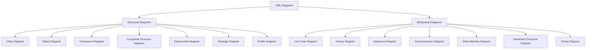

> UML is a standardized modeling language used to visualize, specify, construct, and document the structure and behavior of software systems through a toolkit of graphic notation diagrams.

## What You'll Learn

- What UML is and how it is formally defined
- Why UML diagrams are important (the blueprint analogy)
- The two main categories of UML diagrams: Structural and Behavioral
- The seven types of structural diagrams and their purpose
- The seven types of behavioral diagrams and their purpose
- Why the Class Diagram is the most critical diagram for Low-Level Design

---

## Introduction

### Formal Definition

UML (Unified Modeling Language) is a standardized modeling language used to visualize, specify, construct, and document the structure and behavior of software systems.

It provides a set of graphic notation techniques to create abstract models of systems, covering both static and dynamic aspects.

### Understanding

Think of UML as a toolkit of diagrams that helps software developers and designers map out how a system works, before or alongside writing the actual code. It's like planning a journey with a map — you get a clear picture of where everything is and how it all connects.

### Real-Life Analogy

Imagine you're building a house. Before laying bricks, you'd need blueprints — diagrams that show where each room goes, how pipes connect, and how electricity flows. Without these, things can get messy, expensive, and confusing.

In the same way, UML diagrams are the blueprints of software systems. They help teams design systems clearly, avoid confusion, and catch problems early — before any code is written.

---

## Types of UML Diagrams

UML diagrams are divided into two main categories, each serving a different purpose in modeling software systems.

### 1. Structural Diagrams

These describe the **static structure** of a system — what it contains, how different parts relate to each other, and how data is organized.

They are like the architectural blueprints of the system, showing the foundation, components, and their connections. Structural diagrams focus on the elements that **exist** in the system (like classes, objects, and hardware), rather than what happens during execution.

### 2. Behavioral Diagrams

These describe the **dynamic behavior** of a system — how it behaves over time, how users interact with it, and how parts communicate during execution.

They are like the scripts and animations in a movie — showing what happens, when it happens, and who is involved. Behavioral diagrams focus on actions, interactions, processes, and state changes.

---

## Structural Diagrams

There are seven main types of structural diagrams in UML, each serving a specific purpose in modeling the static aspects of a system.

| **Diagram** | **Purpose** |
| :--- | :--- |
| **Class Diagram** | Shows classes, their properties, methods, and relationships — a map of the code structure. |
| **Object Diagram** | Shows a snapshot of instances of classes and their relationships at a specific point in time. |
| **Component Diagram** | Depicts how software components (modules) are organized and connected. |
| **Composite Structure Diagram** | Shows the internal parts of a class and how they interact to carry out behavior. |
| **Deployment Diagram** | Illustrates how software is physically deployed onto hardware devices or servers. |
| **Package Diagram** | Groups related elements (like classes) into packages for better organization. |
| **Profile Diagram** | Used to customize UML for specific platforms or domains by extending its elements. |

---

## Behavioral Diagrams

There are seven main types of behavioral diagrams in UML, each serving a specific purpose in modeling the dynamic aspects of a system.

| **Diagram** | **Purpose** |
| :--- | :--- |
| **Use Case Diagram** | Captures what users (actors) can do with the system — its high-level functionalities. |
| **Activity Diagram** | Models workflows and business processes — similar to flowcharts. |
| **Sequence Diagram** | Shows the order of messages exchanged between objects over time. |
| **Communication Diagram** | Emphasizes interactions between objects and how they're connected. |
| **State Machine Diagram** | Depicts how an object transitions between states based on events. |
| **Interaction Overview Diagram** | Combines features of sequence and activity diagrams to model interaction flow. |
| **Timing Diagram** | Focuses on object behavior with respect to time, particularly useful for real-time systems. |

---

## Class Diagram and Low-Level Design

> [!IMPORTANT]
> When diving into Low-Level Design, the focus is on the internal structure and detailed interaction of software components. While all UML diagrams have their place, the **Class Diagram** is considered the most important for mastering LLD. It provides a clear view of the classes, their attributes, methods, and relationships, making it essential for understanding how to design and implement software systems effectively.

---

## Summary

| **Concept** | **Description** |
| :--- | :--- |
| **UML** | A standardized modeling language to visualize, specify, construct, and document software systems |
| **Structural Diagrams** | Describe the static structure — what exists in the system and how parts relate |
| **Behavioral Diagrams** | Describe dynamic behavior — how the system acts, reacts, and communicates over time |
