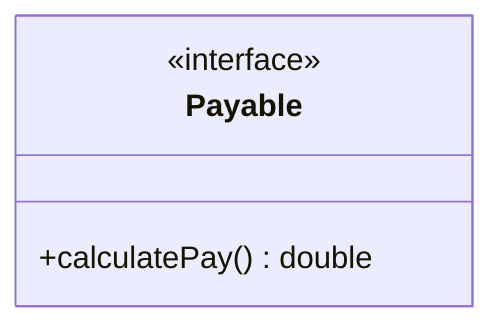
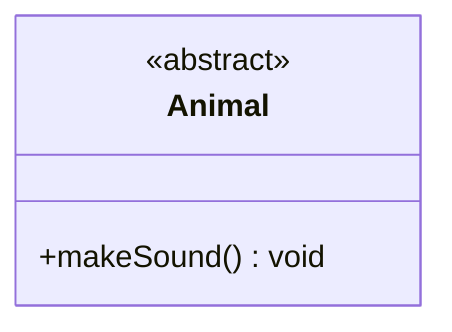
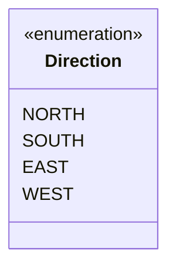
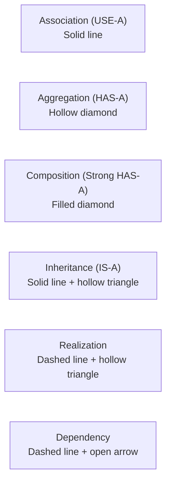
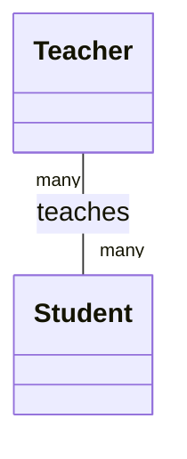
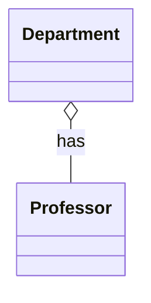
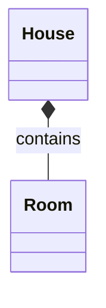
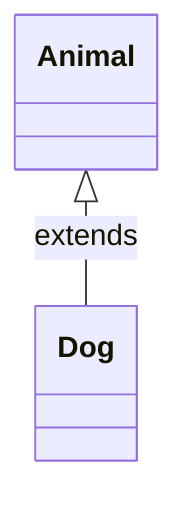
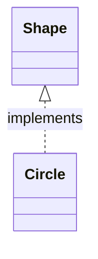
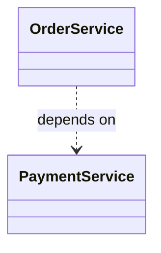

> A UML Class Diagram provides a high-level overview of the system architecture — capturing classes, interfaces, enumerations, their attributes and operations, and the relationships among them.

## What You'll Learn

- What a UML Class Diagram is and why it matters
- How to read and write class notations (attributes, methods, visibility markers)
- How to represent interfaces, abstract classes, and enumerations in UML
- The three perspectives of class diagrams (Conceptual, Specification, Implementation)
- The six types of relationships between classes and their UML notations

---

## Introduction

A UML Class Diagram provides a high-level overview of the system architecture. It captures the system's classes, interfaces, enumerations, their attributes and operations (methods), and the relationships among them. It is instrumental in both forward and reverse engineering processes and is widely used in modeling object-oriented systems.

Class diagrams support various design activities including domain modeling, data modeling, and the architectural representation of systems. These diagrams are often created during the early stages of the software development lifecycle and refined as the project progresses.

Looking at a class diagram, you must quickly be able to understand the system's structure and how different components interact with each other. This is particularly useful for new team members or stakeholders who need to get up to speed with the system's design regardless of understanding the underlying code.

In this section, we will explore the various components of UML Class Diagrams, including classes, attributes, methods, and relationships. We will also discuss the notations used to represent these elements and how they can be effectively utilized in software design.

---

## UML Class Notations

### 1. Class Representation

A class in UML is depicted as a rectangle divided into three compartments:

- **Top compartment:** Contains the class name (bold and centered).
- **Middle compartment:** Lists the attributes.
- **Bottom compartment:** Lists the operations (methods).

```text
┌─────────────────────┐
│      ClassName      │  ← Top: class name (bold, centered)
├─────────────────────┤
│  - attribute: Type  │  ← Middle: attributes
├─────────────────────┤
│  + method(): Return │  ← Bottom: operations (methods)
└─────────────────────┘
```

Each attribute or method is listed with its visibility marker, name, and type (for attributes) or return type (for methods). Parameters for methods are also specified in the parentheses.

---

### 2. Visibility Markers

Visibility markers define access levels for attributes and operations:

| **Marker** | **Visibility** | **Description** |
| :--- | :--- | :--- |
| `+` | Public | Accessible from any other class |
| `-` | Private | Accessible only within the class itself |
| `#` | Protected | Accessible within the class and its subclasses |
| `~` | Package | Accessible within the same package |

These markers help enforce encapsulation, a core principle in object-oriented design.

---

### 3. Attributes and Method Syntax

Attributes and methods follow this syntax in class diagrams:

#### 3.1 Attributes

```text
visibility name: Type [multiplicity] = DefaultValue
```

| **Part** | **Description** |
| :--- | :--- |
| `visibility` | The visibility marker (e.g., `+`, `-`, `#`, `~`) |
| `name` | The name of the attribute |
| `Type` | The data type of the attribute (e.g., `int`, `String`) |
| `multiplicity` | Optional — how many instances can exist (e.g., `0..1`, `1..*`) |
| `DefaultValue` | Optional — a default value for the attribute |

**Example:** To represent `public int age = 21;` in a class diagram:

```text
+ age: int = 21
```

#### 3.2 Methods (Operations)

```text
visibility name(parameterName1: Type1, ...): ReturnType
```

| **Part** | **Description** |
| :--- | :--- |
| `visibility` | The visibility marker (e.g., `+`, `-`, `#`, `~`) |
| `name` | The name of the method |
| `parameterName` | The name of the parameter |
| `Type` | The data type of the parameter |
| `ReturnType` | The return type of the method |

**Example:** To represent the following Java method in a class diagram:

```java
class Person {
    private boolean isAdult(int age) {
        return age >= 18;
    }
}
```

The class diagram notation will look like this:

```text
- isAdult(age: int): boolean
```

> [!NOTE]
> Optional elements like multiplicity, default values, and stereotypes (e.g., `<<constructor>>`, `<<static>>`) can also be included to enrich the diagram.

---

### 4. Interface

An interface defines a contract that other classes must follow. It contains only abstract methods (no implementation). A UML class diagram for interfaces contains the following compartments:

- **Name compartment:** Contains the stereotype `<<interface>>` and the name of the interface.
- **Operation compartment:** Contains method signatures (abstract operations to be implemented).

**Example:**

```java
// Interface for classes that can calculate pay
public interface Payable {

    // Method to calculate pay
    double calculatePay();
}
```



> [!NOTE]
> By default, interfaces don't have a compartment for attributes like regular classes. However, if the interface declares constants, you may include an attribute compartment to show them.

---

### 5. Abstract Class

An abstract class is a class that cannot be instantiated and may contain both implemented and unimplemented (abstract) methods. It is represented in UML class diagrams with the `<<abstract>>` stereotype above the class name and the class name in italic.

**Example:**

```java
// Abstract class representing an Animal
public abstract class Animal {

    // Abstract method to make sound
    public abstract void makeSound();
}
```



---

### 6. Enumeration (Enum)

An enumeration is a data type consisting of a fixed set of named values, often called literals. It is represented in UML class diagrams with the `<<enumeration>>` stereotype above the name in one compartment and the list of literals in another compartment.



---

## Perspectives of Class Diagrams

### 1. Conceptual Perspective

**Purpose:** Provides a high-level view of the system, focusing on the main concepts and their relationships. Used in the early stages of system design to establish a common understanding among stakeholders (Business Analysts, Domain Experts).

**Diagram Style:**
- Classes represent real-world concepts, like `Customer`, `Order`, `Invoice`.
- No attributes or operations are shown unless absolutely necessary.
- Relationships depict business-level associations, not implementation details.

---

### 2. Specification Perspective

**Purpose:** Defines the structure and behavior of the system's classes, focusing on responsibilities, roles, and collaborations without specifying code-level details. This view highlights what operations a class should support, enabling interface and design-level planning. Meant for System Architects and Software Designers.

**Diagram Style:**
- Includes abstract classes, interfaces, and key public methods.
- Shows associations and inheritance relationships between classes and interfaces.
- Focuses on contract-based design (e.g., what a class promises to do).

---

### 3. Implementation Perspective

**Purpose:** Presents a concrete, code-level view of the system. Includes complete class definitions, access modifiers, attributes with types and default values, and full method signatures. Mainly used by developers and software engineers during the implementation phase.

**Diagram Style:**
- Shows all attributes (public, private, etc.) and methods.
- Includes visibility markers (`+` public, `-` private, `#` protected).
- May show data types, default values, and even constructors.
- All relationships — including association, aggregation, composition, inheritance, and dependency — are explicitly visualized.

---

## Relationships Between Classes



### 1. Association (USE-A)

Association represents a general relationship between two classes where one class uses or interacts with another. It can be one-to-one, one-to-many, or many-to-many.

- **Example:** A `Teacher` can teach multiple `Student`s, and a `Student` can be taught by multiple `Teacher`s (many-to-many association).
- **UML Notation:** A solid line between the two classes.



---

### 2. Aggregation (HAS-A)

Aggregation is a "whole-part" relationship where a class is made up of one or more classes, but those parts can exist independently.

- **Example:** A `Department` has multiple `Professor`s. If the department is removed, the professors still exist.
- **UML Notation:** A hollow diamond at the container (whole) class.



---

### 3. Composition (Strong HAS-A)

Composition is a stronger form of aggregation where the part cannot exist without the whole. It is a "whole-part" relationship where the part is dependent on the whole.

- **Example:** A `House` has `Room`s. If the `House` is destroyed, so are the `Room`s.
- **UML Notation:** A filled diamond at the whole side.



---

### 4. Inheritance (IS-A)

Inheritance defines an IS-A relationship where a subclass inherits properties and behavior from a superclass. The subclass can extend or override the superclass's attributes and methods.

- **Example:** A `Dog` is an `Animal`.
- **UML Notation:** A solid line with a hollow triangle pointing to the parent class.



---

### 5. Realization (Implementation)

Realization is the relationship between a class and an interface. The class agrees to implement the behavior declared by the interface.

- **Example:** A `Circle` class implements the `Shape` interface.
- **UML Notation:** A dashed line with a hollow triangle pointing to the interface.



---

### 6. Dependency

Dependency indicates that a class uses another class temporarily. Changes to the used class may affect the dependent class.

- **Example:** `OrderService` depends on `PaymentService` to process payments.
- **UML Notation:** A dashed line with an open arrow pointing to the class being used.



---

## Summary

| **Concept** | **Description** |
| :--- | :--- |
| **Class Diagram** | UML diagram capturing classes, interfaces, enums, attributes, methods, and relationships |
| **Class Notation** | Rectangle with three compartments: name, attributes, operations |
| **Visibility Markers** | `+` public, `-` private, `#` protected, `~` package |
| **Attribute Syntax** | `visibility name: Type [multiplicity] = DefaultValue` |
| **Method Syntax** | `visibility name(param: Type): ReturnType` |
| **Interface** | `<<interface>>` stereotype; contains only abstract method signatures |
| **Abstract Class** | `<<abstract>>` stereotype; can have both concrete and abstract methods |
| **Enumeration** | `<<enumeration>>` stereotype; lists fixed named literals |
| **Conceptual Perspective** | High-level view for stakeholders — real-world concepts, no code detail |
| **Specification Perspective** | Design-level view for architects — interfaces, public methods, contracts |
| **Implementation Perspective** | Code-level view for developers — full attributes, visibility, all relationships |
| **Association (USE-A)** | General usage relationship — solid line |
| **Aggregation (HAS-A)** | Whole-part, parts survive independently — hollow diamond |
| **Composition (Strong HAS-A)** | Whole-part, parts cannot exist without whole — filled diamond |
| **Inheritance (IS-A)** | Subclass extends superclass — solid line with hollow triangle |
| **Realization** | Class implements interface — dashed line with hollow triangle |
| **Dependency** | Temporary usage — dashed line with open arrow |
