# Class Diagram Examples

> A collection of real-world UML class diagram examples paired with Java code — from single classes to complete system designs.

## What You'll Learn

- How to model a single class with attributes and methods in UML
- How to represent inheritance (IS-A), realization, and abstract classes
- How to distinguish association, aggregation, and composition with code
- How to model dependency relationships
- How to incorporate enumerations into class diagrams
- How to read and build complete system-level class diagrams

---

## 1. Single Class — `BankAccount`

The simplest diagram: one class with private attributes and public methods.

```java
public class BankAccount {

    private String accountNumber;
    private String owner;
    private double balance;

    public BankAccount(String accountNumber, String owner) {
        this.accountNumber = accountNumber;
        this.owner = owner;
        this.balance = 0.0;
    }

    public void deposit(double amount) {
        this.balance += amount;
    }

    public boolean withdraw(double amount) {
        if (amount > balance) return false;
        this.balance -= amount;
        return true;
    }

    public double getBalance() {
        return balance;
    }
}
```

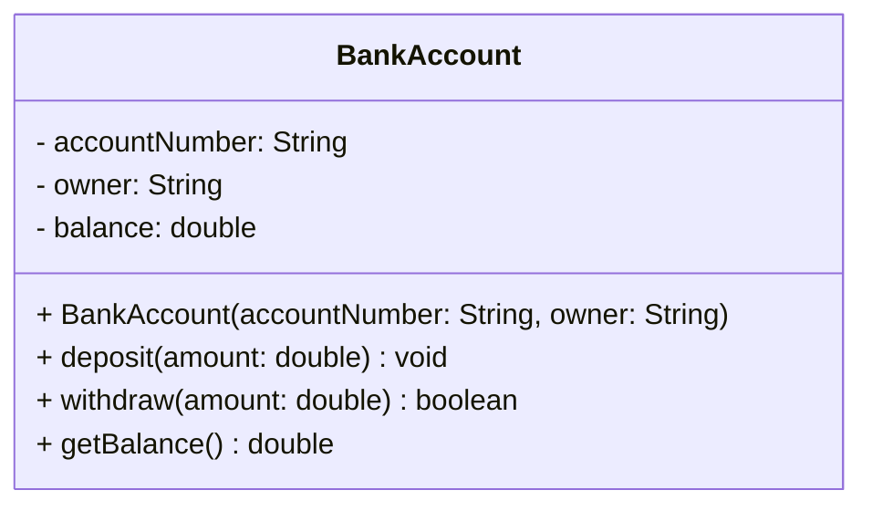

---

## 2. Inheritance (IS-A) — `Animal` Hierarchy

A parent class `Animal` is extended by `Dog` and `Cat`. Each subclass overrides `makeSound()`.

```java
public class Animal {
    protected String name;
    protected int age;

    public Animal(String name, int age) {
        this.name = name;
        this.age = age;
    }

    public void eat() {
        System.out.println(name + " is eating.");
    }

    public void makeSound() {
        System.out.println("...");
    }
}

public class Dog extends Animal {
    private String breed;

    public Dog(String name, int age, String breed) {
        super(name, age);
        this.breed = breed;
    }

    @Override
    public void makeSound() {
        System.out.println("Woof!");
    }

    public void fetch() {
        System.out.println(name + " fetches the ball.");
    }
}

public class Cat extends Animal {
    private boolean isIndoor;

    public Cat(String name, int age, boolean isIndoor) {
        super(name, age);
        this.isIndoor = isIndoor;
    }

    @Override
    public void makeSound() {
        System.out.println("Meow!");
    }
}
```

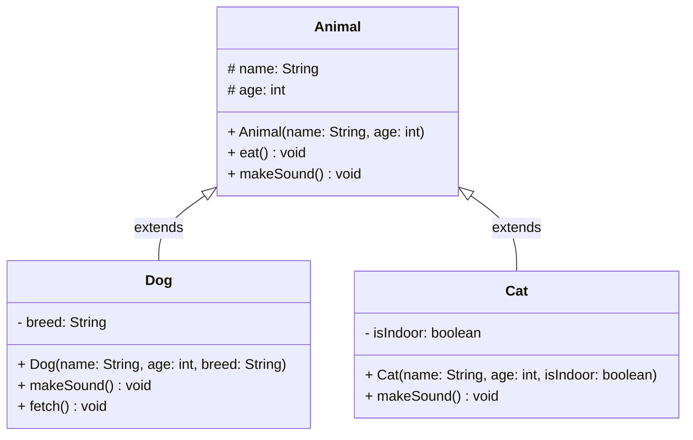

---

## 3. Interface & Realization — `Shape`

An interface `Shape` is implemented by `Circle` and `Rectangle`. Both must provide concrete implementations of `area()` and `perimeter()`.

```java
public interface Shape {
    double area();
    double perimeter();
    void draw();
}

public class Circle implements Shape {
    private double radius;

    public Circle(double radius) {
        this.radius = radius;
    }

    @Override
    public double area() {
        return Math.PI * radius * radius;
    }

    @Override
    public double perimeter() {
        return 2 * Math.PI * radius;
    }

    @Override
    public void draw() {
        System.out.println("Drawing Circle with radius " + radius);
    }
}

public class Rectangle implements Shape {
    private double width;
    private double height;

    public Rectangle(double width, double height) {
        this.width = width;
        this.height = height;
    }

    @Override
    public double area() {
        return width * height;
    }

    @Override
    public double perimeter() {
        return 2 * (width + height);
    }

    @Override
    public void draw() {
        System.out.println("Drawing Rectangle " + width + "x" + height);
    }
}
```

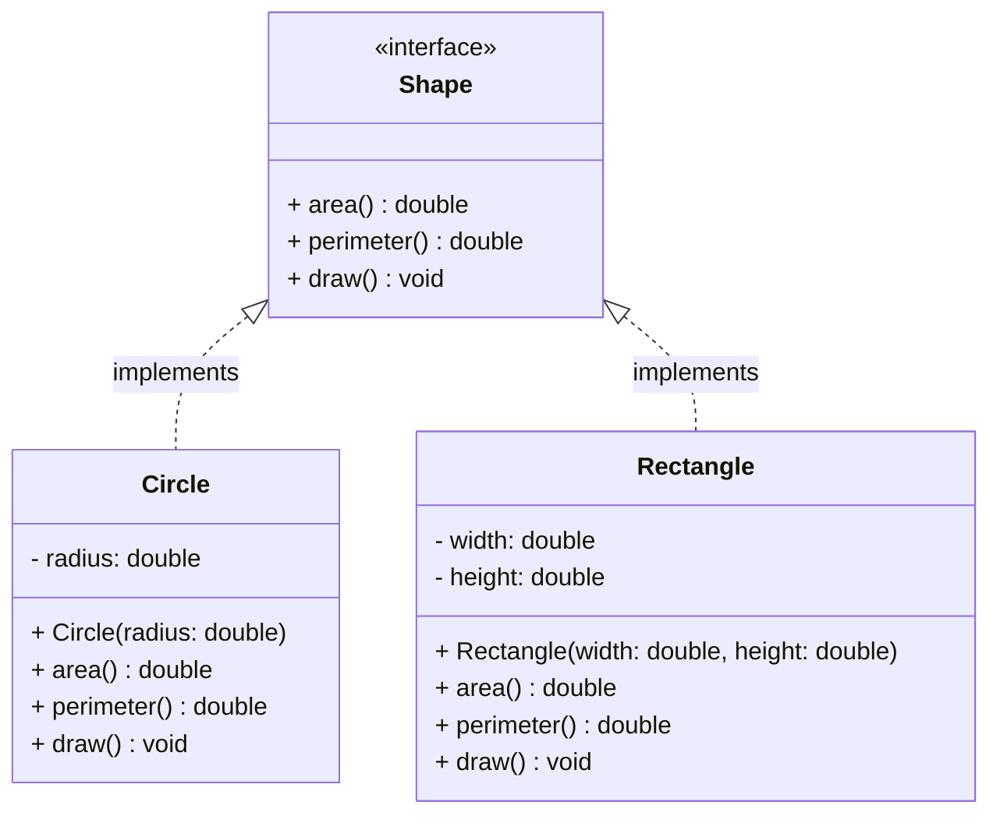

---

## 4. Abstract Class — `Vehicle`

`Vehicle` is an abstract class with a concrete method `startEngine()` and an abstract method `fuelType()`. `Car` and `ElectricBike` extend it.

```java
public abstract class Vehicle {
    protected String brand;
    protected int year;

    public Vehicle(String brand, int year) {
        this.brand = brand;
        this.year = year;
    }

    public void startEngine() {
        System.out.println(brand + " engine started.");
    }

    public abstract String fuelType();
}

public class Car extends Vehicle {
    private int numberOfDoors;

    public Car(String brand, int year, int numberOfDoors) {
        super(brand, year);
        this.numberOfDoors = numberOfDoors;
    }

    @Override
    public String fuelType() {
        return "Petrol";
    }
}

public class ElectricBike extends Vehicle {
    private int batteryCapacityKWh;

    public ElectricBike(String brand, int year, int batteryCapacityKWh) {
        super(brand, year);
        this.batteryCapacityKWh = batteryCapacityKWh;
    }

    @Override
    public String fuelType() {
        return "Electric";
    }
}
```

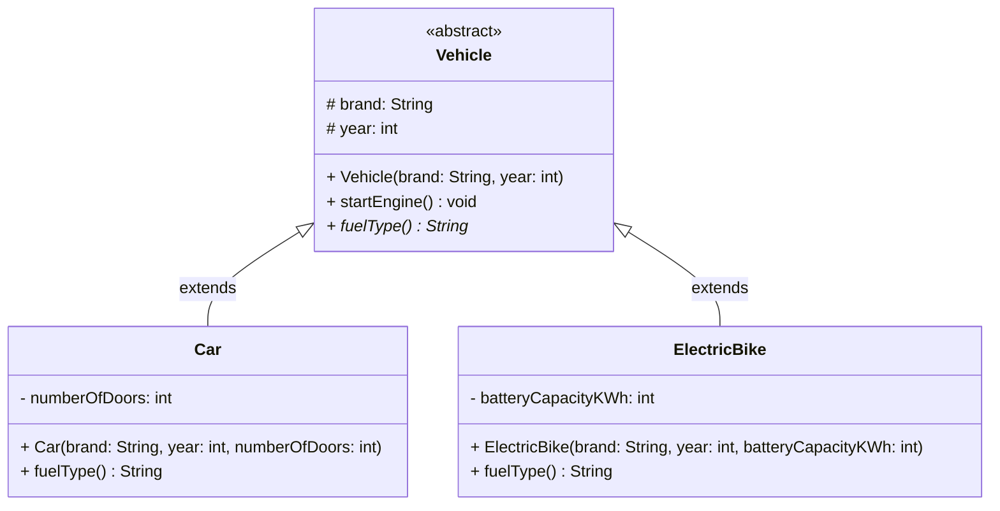

> [!NOTE]
> Abstract methods are conventionally marked with an asterisk (`*`) suffix (e.g., `fuelType()* String`) to distinguish them from concrete methods inside an abstract class.

---

## 5. Association (USE-A) — `Student` and `Course`

A `Student` can enroll in many `Course`s and a `Course` can have many `Student`s — a many-to-many association. Neither owns the other; both can exist independently.

```java
import java.util.*;

public class Course {
    private String courseId;
    private String title;
    private List<Student> enrolledStudents;

    public Course(String courseId, String title) {
        this.courseId = courseId;
        this.title = title;
        this.enrolledStudents = new ArrayList<>();
    }

    public void enrollStudent(Student student) {
        enrolledStudents.add(student);
    }

    public String getTitle() { return title; }
}

public class Student {
    private String studentId;
    private String name;
    private List<Course> enrolledCourses;

    public Student(String studentId, String name) {
        this.studentId = studentId;
        this.name = name;
        this.enrolledCourses = new ArrayList<>();
    }

    public void enroll(Course course) {
        enrolledCourses.add(course);
        course.enrollStudent(this);
    }

    public String getName() { return name; }
}
```

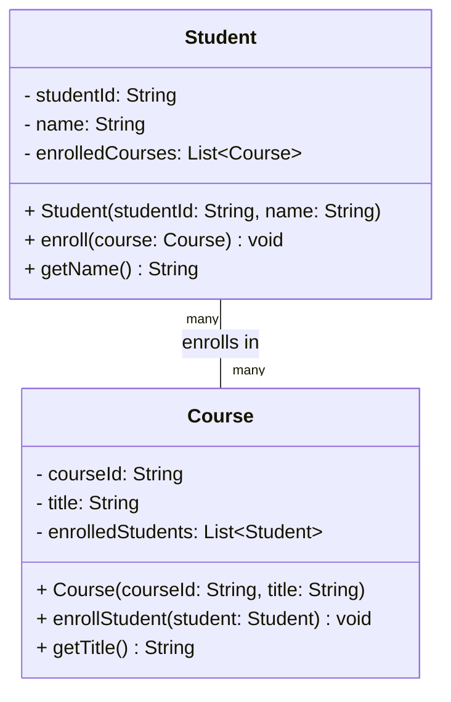

---

## 6. Aggregation (HAS-A) — `Team` and `Player`

A `Team` has many `Player`s, but players can exist independently of the team (e.g., a free agent).

```java
import java.util.*;

public class Player {
    private String name;
    private String position;

    public Player(String name, String position) {
        this.name = name;
        this.position = position;
    }

    public String getName() { return name; }
    public String getPosition() { return position; }
}

public class Team {
    private String teamName;
    private List<Player> players;

    public Team(String teamName) {
        this.teamName = teamName;
        this.players = new ArrayList<>();
    }

    public void addPlayer(Player player) {
        players.add(player);
    }

    public void removePlayer(Player player) {
        players.remove(player);
    }

    public List<Player> getPlayers() { return players; }
}
```

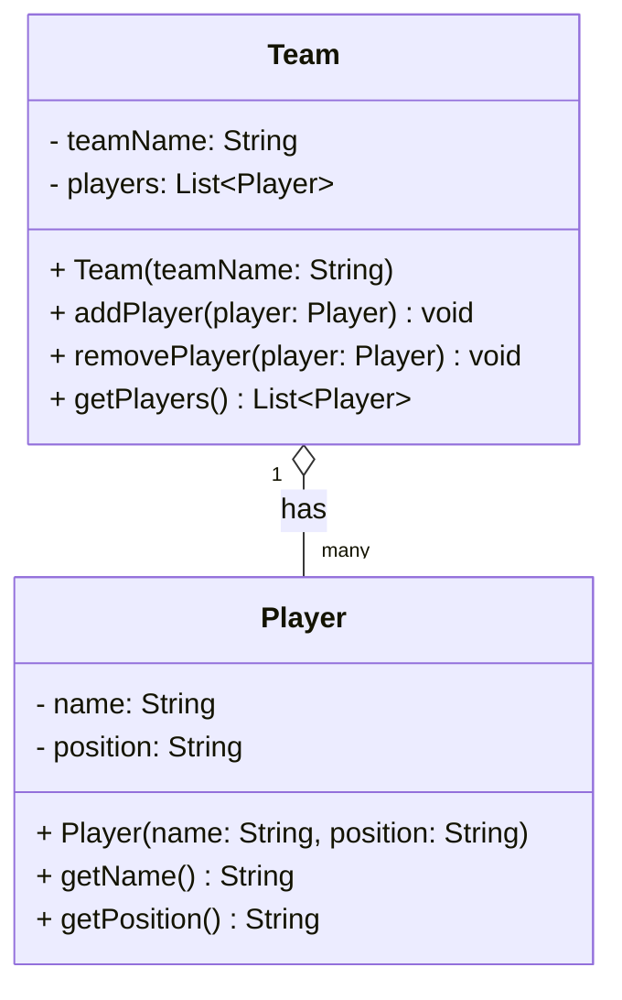

---

## 7. Composition (Strong HAS-A) — `House` and `Room`

A `House` owns its `Room`s. When a `House` object is destroyed, all its `Room` objects are destroyed with it.

```java
import java.util.*;

public class Room {
    private String roomType;
    private double areaSqFt;

    // Room is created by House — not exposed for external instantiation
    Room(String roomType, double areaSqFt) {
        this.roomType = roomType;
        this.areaSqFt = areaSqFt;
    }

    public String getRoomType() { return roomType; }
    public double getAreaSqFt() { return areaSqFt; }
}

public class House {
    private String address;
    private List<Room> rooms;

    public House(String address) {
        this.address = address;
        this.rooms = new ArrayList<>();
        // Rooms are created and owned by the House
        rooms.add(new Room("Living Room", 400));
        rooms.add(new Room("Bedroom", 250));
        rooms.add(new Room("Kitchen", 150));
    }

    public List<Room> getRooms() { return rooms; }
    public String getAddress() { return address; }
}
```

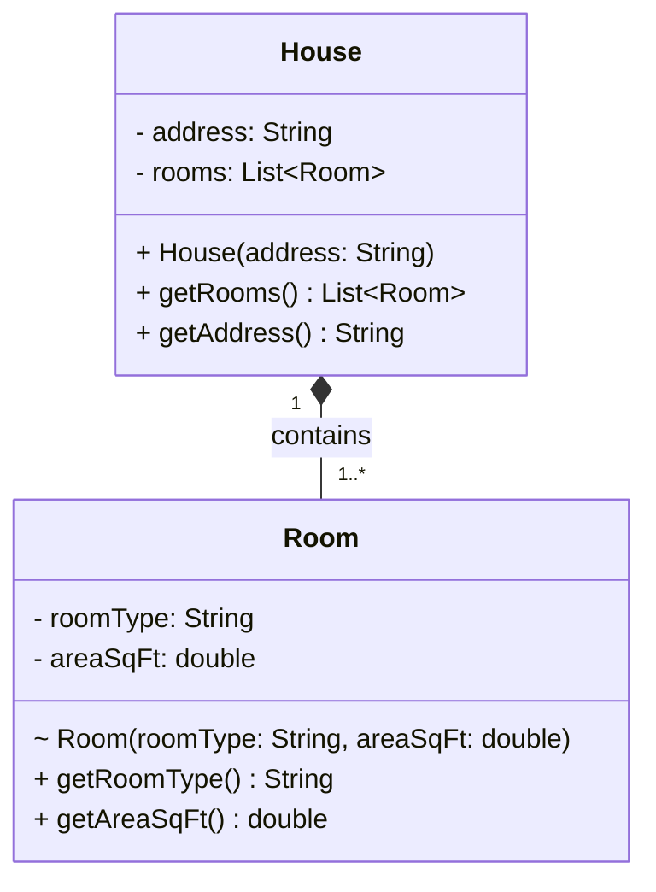

> [!TIP]
> The package-private constructor on `Room` (`~`) signals that only `House` (within the same package) can create `Room`s, enforcing the composition lifecycle constraint in code.

---

## 8. Dependency — `ReportGenerator` uses `PDFExporter`

`ReportGenerator` depends on `PDFExporter` temporarily (it is passed as a method parameter, not stored as a field). A change to `PDFExporter` may break `ReportGenerator`.

```java
public class PDFExporter {
    public void export(String content, String fileName) {
        System.out.println("Exporting to PDF: " + fileName);
        // ... PDF generation logic
    }
}

public class ReportGenerator {
    private String reportData;

    public ReportGenerator(String reportData) {
        this.reportData = reportData;
    }

    // PDFExporter is used temporarily — not stored as a field
    public void generatePDF(PDFExporter exporter, String fileName) {
        exporter.export(reportData, fileName);
    }
}
```

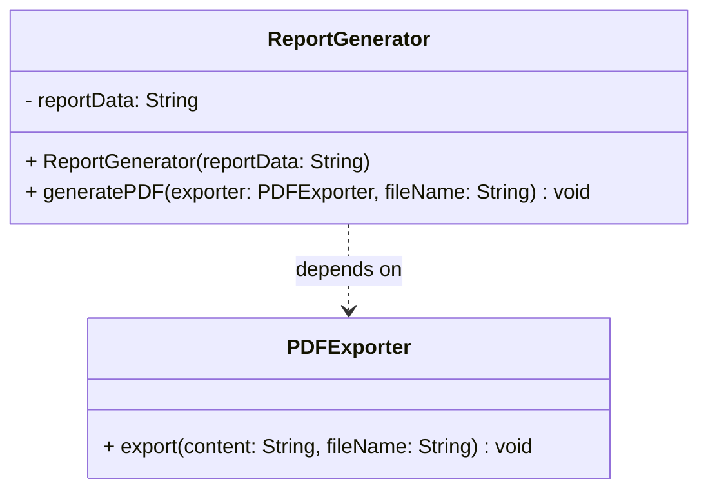

---

## 9. Enumeration in a Class Diagram — `Order` with `OrderStatus`

An `Order` class uses an `OrderStatus` enum to track its current state.

```java
public enum OrderStatus {
    PENDING,
    CONFIRMED,
    SHIPPED,
    DELIVERED,
    CANCELLED
}

public class Order {
    private String orderId;
    private double totalAmount;
    private OrderStatus status;

    public Order(String orderId, double totalAmount) {
        this.orderId = orderId;
        this.totalAmount = totalAmount;
        this.status = OrderStatus.PENDING;
    }

    public void confirm() {
        this.status = OrderStatus.CONFIRMED;
    }

    public void ship() {
        this.status = OrderStatus.SHIPPED;
    }

    public void deliver() {
        this.status = OrderStatus.DELIVERED;
    }

    public void cancel() {
        this.status = OrderStatus.CANCELLED;
    }

    public OrderStatus getStatus() { return status; }
}
```

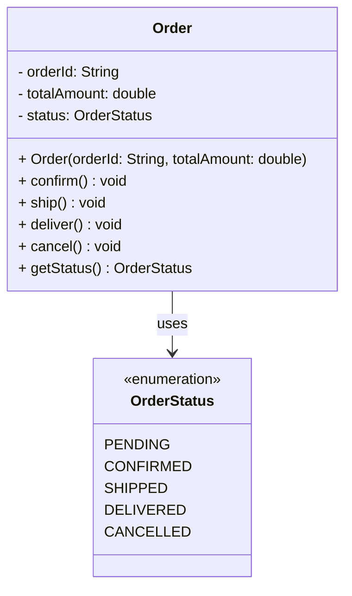

---

## 10. Multiple Interfaces — `SmartDevice`

`SmartDevice` implements two interfaces: `Connectable` and `Chargeable`. This models multiple contracts fulfilled by a single class.

```java
public interface Connectable {
    void connect(String networkName);
    void disconnect();
    boolean isConnected();
}

public interface Chargeable {
    void charge();
    int getBatteryLevel();
}

public class SmartDevice implements Connectable, Chargeable {
    private String deviceId;
    private boolean connected;
    private int batteryLevel;

    public SmartDevice(String deviceId) {
        this.deviceId = deviceId;
        this.connected = false;
        this.batteryLevel = 50;
    }

    @Override
    public void connect(String networkName) {
        this.connected = true;
        System.out.println(deviceId + " connected to " + networkName);
    }

    @Override
    public void disconnect() {
        this.connected = false;
    }

    @Override
    public boolean isConnected() { return connected; }

    @Override
    public void charge() {
        this.batteryLevel = 100;
        System.out.println(deviceId + " fully charged.");
    }

    @Override
    public int getBatteryLevel() { return batteryLevel; }
}
```

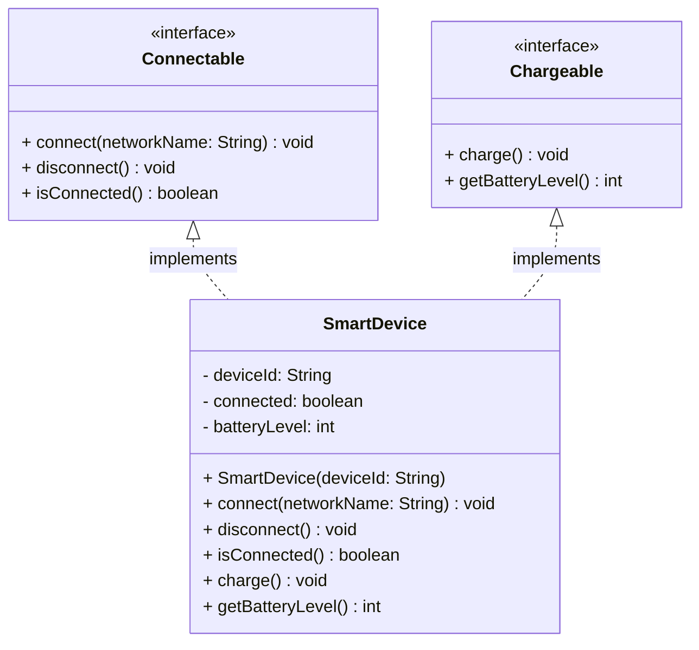

---

## 11. Complete System — Library Management System

A realistic system diagram combining inheritance, composition, association, and enumerations.

### Classes Overview

- `Library` — owns `BookCatalog` (composition), manages `Member`s (association)
- `BookCatalog` — composed of `Book`s
- `Book` — has a `BookStatus` enum
- `Member` — borrows `Book`s, tracked via `Loan`
- `Loan` — links a `Member` to a `Book` with dates

```java
import java.util.*;

public enum BookStatus { AVAILABLE, BORROWED, RESERVED }

public class Book {
    private String isbn;
    private String title;
    private String author;
    private BookStatus status;

    public Book(String isbn, String title, String author) {
        this.isbn = isbn;
        this.title = title;
        this.author = author;
        this.status = BookStatus.AVAILABLE;
    }

    public BookStatus getStatus() { return status; }
    public void setStatus(BookStatus status) { this.status = status; }
    public String getIsbn() { return isbn; }
    public String getTitle() { return title; }
}

public class BookCatalog {
    private List<Book> books = new ArrayList<>();

    public void addBook(Book book) { books.add(book); }

    public Book findByIsbn(String isbn) {
        return books.stream()
                    .filter(b -> b.getIsbn().equals(isbn))
                    .findFirst()
                    .orElse(null);
    }

    public List<Book> getAvailableBooks() {
        return books.stream()
                    .filter(b -> b.getStatus() == BookStatus.AVAILABLE)
                    .toList();
    }
}

public class Member {
    private String memberId;
    private String name;
    private List<Loan> activeLoans = new ArrayList<>();

    public Member(String memberId, String name) {
        this.memberId = memberId;
        this.name = name;
    }

    public void addLoan(Loan loan) { activeLoans.add(loan); }
    public List<Loan> getActiveLoans() { return activeLoans; }
    public String getMemberId() { return memberId; }
    public String getName() { return name; }
}

public class Loan {
    private Member member;
    private Book book;
    private String borrowDate;
    private String dueDate;

    public Loan(Member member, Book book, String borrowDate, String dueDate) {
        this.member = member;
        this.book = book;
        this.borrowDate = borrowDate;
        this.dueDate = dueDate;
    }

    public Book getBook() { return book; }
    public Member getMember() { return member; }
}

public class Library {
    private String name;
    private BookCatalog catalog;          // composition — catalog cannot exist without library
    private List<Member> members;         // association — members are independent

    public Library(String name) {
        this.name = name;
        this.catalog = new BookCatalog();
        this.members = new ArrayList<>();
    }

    public void registerMember(Member member) { members.add(member); }

    public Loan borrowBook(String memberId, String isbn, String borrowDate, String dueDate) {
        Member member = members.stream()
                               .filter(m -> m.getMemberId().equals(memberId))
                               .findFirst().orElseThrow();
        Book book = catalog.findByIsbn(isbn);
        if (book == null || book.getStatus() != BookStatus.AVAILABLE) return null;

        book.setStatus(BookStatus.BORROWED);
        Loan loan = new Loan(member, book, borrowDate, dueDate);
        member.addLoan(loan);
        return loan;
    }
}
```

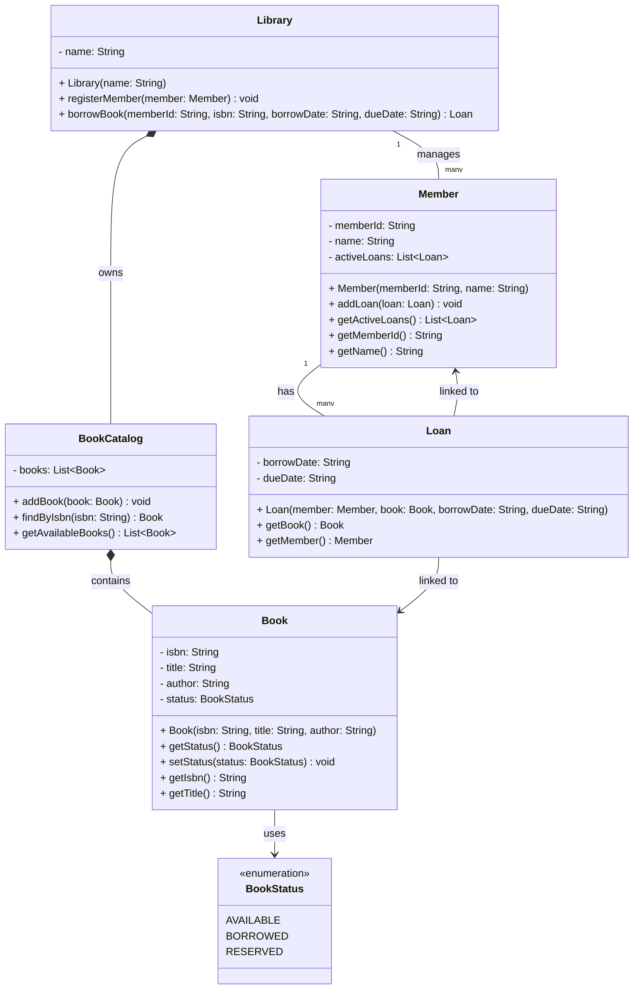

---

## 12. Complete System — E-Commerce Order System

A system showing how `Customer`, `Order`, `Product`, `Payment`, and `Address` interact, using all six relationship types.

```java
import java.util.*;

public enum PaymentMethod { CREDIT_CARD, UPI, NET_BANKING, WALLET }
public enum PaymentStatus { PENDING, SUCCESS, FAILED }

public class Address {
    private String street;
    private String city;
    private String pinCode;

    public Address(String street, String city, String pinCode) {
        this.street = street;
        this.city = city;
        this.pinCode = pinCode;
    }

    public String getFullAddress() {
        return street + ", " + city + " - " + pinCode;
    }
}

public class Product {
    private String productId;
    private String name;
    private double price;
    private int stockQuantity;

    public Product(String productId, String name, double price, int stockQuantity) {
        this.productId = productId;
        this.name = name;
        this.price = price;
        this.stockQuantity = stockQuantity;
    }

    public boolean isAvailable(int quantity) { return stockQuantity >= quantity; }
    public double getPrice() { return price; }
    public String getName() { return name; }
}

public class OrderItem {
    private Product product;   // association — product exists independently
    private int quantity;
    private double unitPrice;

    public OrderItem(Product product, int quantity) {
        this.product = product;
        this.quantity = quantity;
        this.unitPrice = product.getPrice();
    }

    public double getSubtotal() { return unitPrice * quantity; }
}

public class Payment {
    private String paymentId;
    private double amount;
    private PaymentMethod method;
    private PaymentStatus status;

    public Payment(String paymentId, double amount, PaymentMethod method) {
        this.paymentId = paymentId;
        this.amount = amount;
        this.method = method;
        this.status = PaymentStatus.PENDING;
    }

    public void process() { this.status = PaymentStatus.SUCCESS; }
    public PaymentStatus getStatus() { return status; }
}

public class Order {
    private String orderId;
    private List<OrderItem> items;    // composition — items are part of this order
    private Payment payment;          // composition — payment is created for this order
    private Address shippingAddress;  // association — address can belong to multiple orders

    public Order(String orderId, Address shippingAddress) {
        this.orderId = orderId;
        this.shippingAddress = shippingAddress;
        this.items = new ArrayList<>();
    }

    public void addItem(OrderItem item) { items.add(item); }

    public double getTotalAmount() {
        return items.stream().mapToDouble(OrderItem::getSubtotal).sum();
    }

    public void setPayment(Payment payment) { this.payment = payment; }
    public String getOrderId() { return orderId; }
}

public class Customer {
    private String customerId;
    private String email;
    private List<Address> addresses;  // aggregation — addresses can exist without customer
    private List<Order> orderHistory; // aggregation — orders exist independently

    public Customer(String customerId, String email) {
        this.customerId = customerId;
        this.email = email;
        this.addresses = new ArrayList<>();
        this.orderHistory = new ArrayList<>();
    }

    public void addAddress(Address address) { addresses.add(address); }
    public void placeOrder(Order order) { orderHistory.add(order); }
    public List<Order> getOrderHistory() { return orderHistory; }
}
```

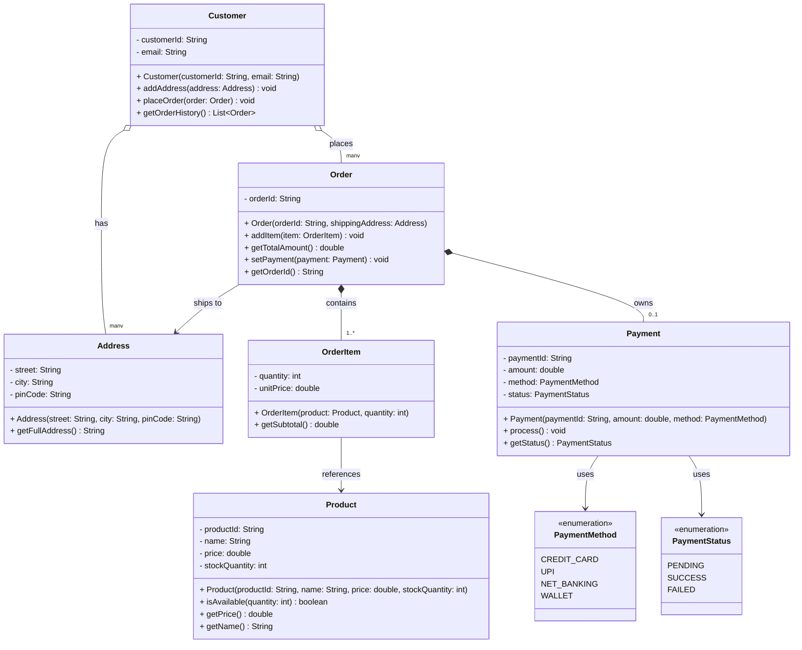

---

## Summary

| **Example** | **Key Relationship(s)** | **Concept Demonstrated** |
| :--- | :--- | :--- |
| **BankAccount** | — | Single class with visibility markers |
| **Animal Hierarchy** | Inheritance | IS-A, method overriding |
| **Shape** | Realization | Interface contract with multiple implementors |
| **Vehicle** | Inheritance | Abstract class with abstract methods |
| **Student & Course** | Association | Many-to-many, no ownership |
| **Team & Player** | Aggregation | HAS-A, parts survive independently |
| **House & Room** | Composition | Strong HAS-A, lifecycle dependency |
| **ReportGenerator** | Dependency | Temporary usage via method parameter |
| **Order & OrderStatus** | Dependency on Enum | Enumeration embedded in a class |
| **SmartDevice** | Realization | Multiple interface implementation |
| **Library System** | Composition + Association + Enum | Full system design, multi-relationship |
| **E-Commerce System** | All six relationships | Real-world system combining every UML relationship type |
