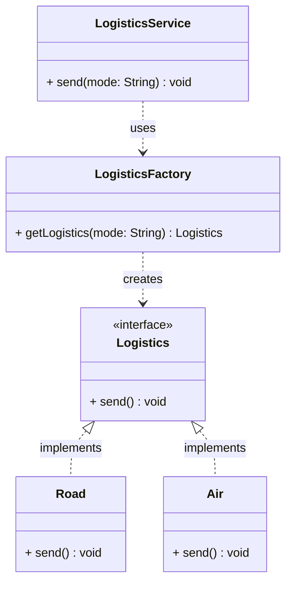

# Factory Pattern

> The Factory Pattern is a creational design pattern that provides an interface for creating objects but allows subclasses to alter the type of objects that will be created.

## What You'll Learn

- What the Factory Pattern is and when to use it
- The real-world analogy that makes the pattern intuitive
- The basic structure and components of the Factory Pattern
- How object creation without the pattern leads to tightly coupled code
- How applying the Factory Pattern cleanly separates concerns
- The pros and cons of the Factory Pattern

---

## 1. What Is the Factory Pattern?

Rather than calling a constructor directly to create an object, we use a **factory method** to create that object based on some input or condition.

### When Should You Use It?

Use the Factory Pattern when:

- The client code needs to work with multiple types of objects.
- The decision of which class to instantiate must be made at **runtime**.
- The instantiation process is complex or needs to be controlled.

### Real-World Analogy — Ordering Pizza

Imagine you walk into a pizza shop and say, "I'd like a pizza." The shop doesn't ask you to go into the kitchen and make it yourself. Instead, it asks, "Which type? Margherita? Pepperoni? Veggie?" Based on your choice, the kitchen (factory) creates the specific pizza for you and hands it over.

You (the client) don't care how it's made or what specific class of ingredients is used. You just want your pizza. The factory (kitchen) handles the creation logic behind the scenes.

This is exactly what the Factory Pattern does in code: it creates an object based on some input **without exposing the instantiation logic** to the client.

---

## 2. Basic Structure of Factory Pattern

The Factory Pattern typically consists of the following components:

- **Product** — An interface or abstract class that defines the methods the product must implement.
- **Concrete Products** — The concrete classes that implement the `Product` interface.
- **Factory** — A class with a method that returns different concrete products based on input.

```java
// Product interface
interface Shape {
    void draw();
}

// Concrete Product
class Circle implements Shape {
    @Override
    public void draw() {
        System.out.println("Drawing Circle");
    }
}

// Concrete Product
class Square implements Shape {
    @Override
    public void draw() {
        System.out.println("Drawing Square");
    }
}

// Factory Class
class ShapeFactory {
    // Returns the corresponding object based on input type
    public Shape getShape(String shapeType) {
        if (shapeType.equalsIgnoreCase("CIRCLE")) {
            return new Circle();
        } else if (shapeType.equalsIgnoreCase("SQUARE")) {
            return new Square();
        }
        return null;
    }
}

// Driver code
class Main {
    public static void main(String[] args) {
        ShapeFactory shapeFactory = new ShapeFactory();

        Shape shape1 = shapeFactory.getShape("CIRCLE");
        shape1.draw();

        Shape shape2 = shapeFactory.getShape("SQUARE");
        shape2.draw();
    }
}
```

Here, `ShapeFactory` is the factory that returns different objects (`Circle`, `Square`) based on input.

---

## 3. Real-Life Example — Logistics Services

Let's say you are building a logistics application that needs to handle different types of transport services: By Road, By Air, etc.

### Bad Practice — Not Following Factory Pattern

Consider the following code where object creation logic is **tightly coupled** with business logic:

```java
// Logistics Interface
interface Logistics {
    void send();
}

class Road implements Logistics {
    @Override
    public void send() {
        System.out.println("Sending by road logic");
    }
}

class Air implements Logistics {
    @Override
    public void send() {
        System.out.println("Sending by air logic");
    }
}

// Object creation logic mixed into business logic
class LogisticsService {
    public void send(String mode) {
        if (mode.equals("Air")) {
            Logistics logistics = new Air();
            logistics.send();
        } else if (mode.equals("Road")) {
            Logistics logistics = new Road();
            logistics.send();
        }
    }
}

class Main {
    public static void main(String[] args) {
        LogisticsService service = new LogisticsService();
        service.send("Air");
        service.send("Road");
    }
}
```

#### Understanding the Issue

In the `LogisticsService` class:

- The object of `Air` or `Road` is directly instantiated based on string comparison.
- The object creation logic is embedded inside the business logic (`send` method).
- This violates the **Open/Closed Principle** — if you want to add a new mode (e.g., `Ship`), you have to modify the `send` method.

**Problems:**

- **Tight Coupling** — `LogisticsService` depends directly on `Air` and `Road` classes.
- **Hard to Extend** — Adding a new mode (e.g., Drone, Ship) requires modifying existing code.
- **No Separation of Concerns** — Object creation and business logic are mixed.
- **Code Duplication** — Repeated instantiation and `send()` logic.
- **Testing & Maintenance Nightmare** — Hard to test independently or mock logistics.

---

### Good Practice — Following Factory Pattern

Applying the Factory Pattern separates object creation from business logic and makes the system scalable.

```java
// Logistics Interface
interface Logistics {
    void send();
}

class Road implements Logistics {
    @Override
    public void send() {
        System.out.println("Sending by road logic");
    }
}

class Air implements Logistics {
    @Override
    public void send() {
        System.out.println("Sending by air logic");
    }
}

// Factory Class — centralizes object creation
class LogisticsFactory {
    public static Logistics getLogistics(String mode) {
        if (mode.equalsIgnoreCase("Air")) {
            return new Air();
        } else if (mode.equalsIgnoreCase("Road")) {
            return new Road();
        }
        throw new IllegalArgumentException("Unknown logistics mode: " + mode);
    }
}

// Service class now focuses only on business logic
class LogisticsService {
    public void send(String mode) {
        Logistics logistics = LogisticsFactory.getLogistics(mode);
        logistics.send();
    }
}

class Main {
    public static void main(String[] args) {
        LogisticsService service = new LogisticsService();
        service.send("Air");
        service.send("Road");
    }
}
```

#### Understanding the Improvement

In this refactored code:

- The object creation logic is moved to `LogisticsFactory`.
- `LogisticsService` now only focuses on business logic.
- Adding a new mode (e.g., `Ship`) only requires modifying the factory, **not the service**.

**Benefits:**

- **Loose Coupling** — The service is decoupled from specific logistics classes.
- **Open/Closed Principle** — New modes can be added without modifying existing code.
- **Separation of Concerns** — Object creation and business logic are separated.
- **No Code Duplication** — Instantiation logic is centralized in the factory.
- **Easier Testing & Maintenance** — Each component can be tested independently.

---

## 4. Class Diagram



---

## 5. Pros of Factory Pattern

- **Promotes Loose Coupling** — The client code is decoupled from the actual instantiation of classes. You work with interfaces rather than concrete classes.
- **Enhances Extensibility (OCP)** — You can introduce new classes (e.g., a new logistics mode like `Ship`) without modifying existing client code. The system becomes easier to scale and extend.
- **Centralizes Object Creation (SRP)** — The responsibility of object creation is moved to a dedicated factory class. Business logic stays clean and focused only on *what to do* with the object.
- **Increases Flexibility** — The decision of "which object to create" can be deferred to runtime based on input, config, or logic, making the system adaptable to dynamic requirements.
- **Improves Code Reusability** — Common instantiation logic can be reused from a single factory. Avoids code duplication when creating similar objects in different parts of the system.

---

## 6. Cons of Factory Pattern

- **Increased Complexity** — Introduces additional layers (factory classes/interfaces) which might be overkill for very small programs.
- **More Code Overhead** — Requires writing extra code like factory classes and interfaces, which might look unnecessary in simpler use cases.

---

## Summary

| **Aspect** | **Detail** |
| :--- | :--- |
| **Pattern Type** | Creational |
| **Intent** | Delegate object creation to a factory instead of calling constructors directly |
| **Key Components** | Product (interface), Concrete Products, Factory class |
| **Core Benefit** | Decouples client code from concrete class instantiation |
| **OCP Compliance** | New types can be added by extending the factory, not modifying existing code |
| **SRP Compliance** | Creation logic and business logic are separated into distinct classes |
| **Key Drawbacks** | Extra classes and complexity; may be overkill for simple programs |
