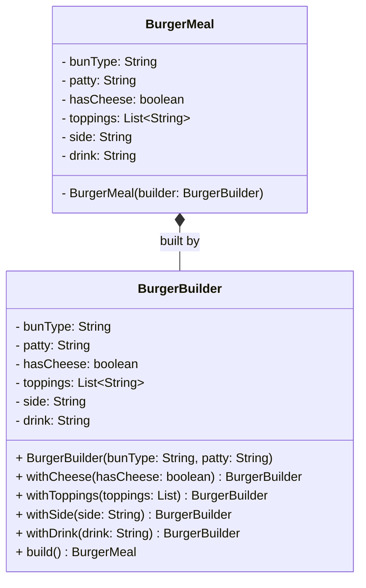

# Builder Pattern

> The Builder Pattern is a creational design pattern that separates the construction of a complex object from its representation, allowing you to create different types and representations of an object using the same construction process.

## What You'll Learn

- What the Builder Pattern is and its formal definition
- The problem it solves — telescoping constructors and messy object creation
- How to implement the Builder Pattern step by step in Java
- Why the Builder approach is superior to constructor overloading
- When to use and when to avoid the Builder Pattern
- Real-world products that use this pattern

---

## 1. What Is the Builder Pattern?

> *"Builder pattern builds a complex object step by step. It separates the construction of a complex object from its representation, so that the same construction process can create different representations."*

Rather than constructing a complex object all at once via a constructor, the Builder Pattern lets you build it **step by step**, specifying only the parts you need.

### Real-World Analogy — Custom Pizza Order

Think of ordering a pizza online. You select the crust type, size, toppings, cheese, and sauce — all step by step. The pizza shop then builds your pizza according to your selections. Different customers can use the same process to get entirely different pizzas.

This is the essence of the Builder Pattern: a structured, step-wise approach to creating customized, complex objects.

---

## 2. Understanding the Problem

Imagine you're building a `BurgerMeal` in your application. A burger must have some **mandatory** components (`Bun`, `Patty`) and some **optional** components (`Sides`, `Toppings`, `Cheese`).

### Traditional Constructor Approach

```java
import java.util.*;

class BurgerMeal {
    // Mandatory components
    private String bun;
    private String patty;

    // Optional components
    private String sides;
    private List<String> toppings;
    private boolean cheese;

    // Constructor trying to handle all combinations
    public BurgerMeal(String bun, String patty, String sides, List<String> toppings, boolean cheese) {
        this.bun = bun;
        this.patty = patty;
        this.sides = sides;
        this.toppings = toppings;
        this.cheese = cheese;
    }
}

class Main {
    public static void main(String[] args) {
        // Constructing with only required details — nulls everywhere
        BurgerMeal burgerMeal = new BurgerMeal("wheat", "veg", null, null, false);
    }
}
```

#### Issues in This Code

- **Hard to Read and Maintain** — The caller must remember the order of parameters and their types. Becomes unreadable as more optional parameters are added.
- **Unnecessary `null` Values** — Even if the user doesn't want toppings or sides, they still have to pass `null` explicitly, cluttering object creation code.
- **Risk of `NullPointerException`** — If we forget to null-check before accessing optional values inside the class, it may lead to runtime exceptions.
- **Too Many Constructor Overloads** — To handle various combinations, you'd need multiple overloaded constructors — not scalable.
- **Tight Coupling Between Parameters and Construction** — No flexibility to set values step by step; the entire object must be built in one go.

---

## 3. Telescoping Constructor Anti-Pattern

To manage optional parameters, many developers write multiple overloaded constructors — each with one more optional parameter than the last:

```java
class BurgerMeal {
    public BurgerMeal(String bun, String patty) { ... }
    public BurgerMeal(String bun, String patty, boolean cheese) { ... }
    public BurgerMeal(String bun, String patty, boolean cheese, String side) { ... }
    public BurgerMeal(String bun, String patty, boolean cheese, String side, String drink) { ... }
}
```

This is called the **Telescoping Constructor Anti-Pattern**. The cascade of constructors becomes:

- Hard to read and write
- Error-prone due to confusing parameter order
- Difficult to maintain when more fields are added
- Inflexible, as users must use parameters in a specific order

> [!NOTE]
> This problem is most common in Java, which lacks support for optional or default parameters (unlike C++ or Python). Because of this, developers are forced to create multiple constructor overloads to handle different combinations — and it clearly doesn't scale. This is exactly the kind of problem the Builder Pattern is designed to solve.

---

## 4. The Solution — Builder Pattern

The Builder Pattern solves these problems by separating object construction from its representation, allowing step-by-step creation while keeping the object immutable and readable.

```java
import java.util.*;

class BurgerMeal {
    // Required components
    private final String bunType;
    private final String patty;

    // Optional components
    private final boolean hasCheese;
    private final List<String> toppings;
    private final String side;
    private final String drink;

    // Private constructor — forces use of Builder
    private BurgerMeal(BurgerBuilder builder) {
        this.bunType = builder.bunType;
        this.patty = builder.patty;
        this.hasCheese = builder.hasCheese;
        this.toppings = builder.toppings;
        this.side = builder.side;
        this.drink = builder.drink;
    }

    // Static nested Builder class
    public static class BurgerBuilder {
        // Required
        private final String bunType;
        private final String patty;

        // Optional
        private boolean hasCheese;
        private List<String> toppings;
        private String side;
        private String drink;

        // Builder constructor with only required fields
        public BurgerBuilder(String bunType, String patty) {
            this.bunType = bunType;
            this.patty = patty;
        }

        public BurgerBuilder withCheese(boolean hasCheese) {
            this.hasCheese = hasCheese;
            return this;
        }

        public BurgerBuilder withToppings(List<String> toppings) {
            this.toppings = toppings;
            return this;
        }

        public BurgerBuilder withSide(String side) {
            this.side = side;
            return this;
        }

        public BurgerBuilder withDrink(String drink) {
            this.drink = drink;
            return this;
        }

        // Final step — build and return the immutable object
        public BurgerMeal build() {
            return new BurgerMeal(this);
        }
    }
}

class Main {
    public static void main(String[] args) {
        // Only required fields
        BurgerMeal plainBurger = new BurgerMeal.BurgerBuilder("wheat", "veg")
                                     .build();

        // With cheese only
        BurgerMeal burgerWithCheese = new BurgerMeal.BurgerBuilder("wheat", "veg")
                                          .withCheese(true)
                                          .build();

        // Fully loaded burger
        List<String> toppings = Arrays.asList("lettuce", "onion", "jalapeno");
        BurgerMeal loadedBurger = new BurgerMeal.BurgerBuilder("multigrain", "chicken")
                                          .withCheese(true)
                                          .withToppings(toppings)
                                          .withSide("fries")
                                          .withDrink("coke")
                                          .build();
    }
}
```

### Understanding the Code

- **Private Constructor** — The constructor of `BurgerMeal` is private so that object creation is restricted to the `BurgerBuilder` only.
- **Nested Static `BurgerBuilder` Class** — Holds the same fields as `BurgerMeal`. Ensures immutability and keeps construction controlled.
- **Fluent API Style** — Each `withXYZ()` method returns `this` (the builder itself), enabling method chaining in a readable, expressive manner.
- **Selective Configuration** — Only required fields (`bunType`, `patty`) are passed to the builder's constructor. Everything else is optional.
- **Final Step: `build()`** — Once all desired fields are set, calling `.build()` finalizes construction and returns the `BurgerMeal` instance.

---

## 5. Why This Is Better

| **Aspect** | **Constructor Approach** | **Builder Pattern** |
| :--- | :--- | :--- |
| **Object readability** | Poor (nulls, long argument list) | Excellent (fluent and expressive) |
| **Flexibility** | Low (all-or-nothing setup) | High (configure only what's needed) |
| **Maintainability** | Hard to scale with more fields | Easy to extend with more options |
| **Safety** | High chance of errors with nulls | Controlled and safe instantiation |

---

## 6. Class Diagram



---

## 7. When to Use and When to Avoid

### When to Use

- An object has **multiple fields**, especially when many of them are optional. Managing such objects using constructors becomes messy and error-prone.
- **Immutability is preferred** — Builder lets you construct an object step by step and then make it immutable once built.
- You want **readable, maintainable object creation**, especially when dealing with domain models or configuration objects. The fluent interface style improves clarity and flexibility.

### When to Avoid

- Your class has only **1–2 fields** — Using a constructor or setter methods is simpler and more concise.
- You **don't need object customization or immutability** — If the object is small, mutable, or built only in one place, a builder adds unnecessary complexity.

---

## 8. Pros of Builder Pattern

- **Avoids Constructor Telescoping** — No more multiple overloaded constructors for different configurations.
- **Ensures Immutability** — The final object can be made immutable once built, improving safety and thread-safety.
- **Clean, Readable Object Creation** — The fluent API makes object construction expressive and easy to follow.
- **Great for Complex Configurations** — If your object has many optional parameters or conditional setup, the builder keeps it organized.

---

## 9. Cons of Builder Pattern

- **Slightly Tough to Set Up** — Initial setup requires writing a separate builder class, which adds to boilerplate.
- **Overkill for Small Classes** — If a class only has one or two fields, using a builder adds unnecessary complexity.
- **Separate Builder Class Needed** — You need to maintain a second class or static inner class just to construct the main object, increasing maintenance overhead.

---

## 10. Real-World Products Using Builder Pattern

### Lombok's `@Builder` Annotation (Java)

Lombok is a Java library that reduces boilerplate code using annotations. The `@Builder` annotation automatically generates a builder class behind the scenes.

Instead of writing the builder logic manually, you just annotate your class:

```java
@Builder
public class User {
    private String name;
    private int age;
    private String address;
}
```

You can then build objects using a fluent API:

```java
User user = User.builder()
            .name("John")
            .age(30)
            .address("NYC")
            .build();
```

### Amazon Cart Configuration

When you add an item to Amazon's cart, you're not just storing an item ID — you're building a complex object with fields like:

- Quantity
- Size or color (for apparel)
- Delivery option
- Gift wrap
- Save for later status
- Discounted price or offer tag

Each user may customize these options differently. Internally, such cart items are likely created using a Builder Pattern to allow step-by-step configuration while ensuring data consistency and immutability.

---

## Summary

| **Aspect** | **Detail** |
| :--- | :--- |
| **Pattern Type** | Creational |
| **Intent** | Build complex objects step by step, separating construction from representation |
| **Key Components** | Product class, static nested Builder class, fluent `withXYZ()` methods, `build()` |
| **Problem Solved** | Eliminates telescoping constructors and messy null-heavy object creation |
| **Core Benefit** | Readable, flexible, immutable object creation via fluent API |
| **Best Used When** | Object has many optional fields or immutability is required |
| **Avoid When** | Object has only 1–2 fields or no customization is needed |
| **Real-World Examples** | Lombok `@Builder`, Amazon cart item construction |
