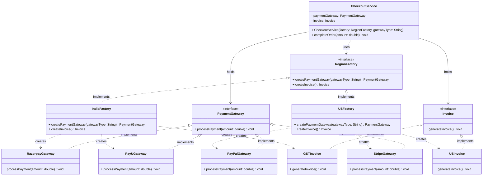

# Abstract Factory Pattern

> The Abstract Factory Pattern is a creational design pattern that provides an interface for creating families of related or dependent objects without specifying their concrete classes.

## What You'll Learn

- What the Abstract Factory Pattern is and when to use it
- How tightly coupled object creation leads to poor design
- How to refactor using the Abstract Factory Pattern
- The key differences between a bad design and the improved design
- The class diagram structure of the pattern
- The pros and cons of the Abstract Factory Pattern

---

## 1. What Is the Abstract Factory Pattern?

You use it when you have **multiple factories**, each responsible for producing objects that are meant to **work together**.

### When Should You Use It?

Use the Abstract Factory Pattern when:

- Multiple related objects must be created as part of a **cohesive set** (e.g., a payment gateway and its corresponding invoice generator).
- The type of objects to be instantiated depends on a specific **context** such as country, theme, or platform.
- **Client code should remain independent** of concrete product classes.
- **Consistency across a family of related products** must be maintained (e.g., a US payment gateway paired with a US-style invoice).

---

## 2. Real-Life Example — Checkout Service

Imagine we're building a **Checkout Service** for a platform like TUF Plus that supports multiple regions, each with its own payment gateways and invoice formats.

### Bad Design — Hardcoded Object Creation in `CheckoutService`

This version tightly couples business logic with object creation. It works for a simple scenario but quickly becomes problematic as the application scales or needs to support multiple payment gateways and invoice formats.

```java
// Interface representing any payment gateway
interface PaymentGateway {
    void processPayment(double amount);
}

// Concrete implementation: Razorpay
class RazorpayGateway implements PaymentGateway {
    public void processPayment(double amount) {
        System.out.println("Processing INR payment via Razorpay: " + amount);
    }
}

// Concrete implementation: PayU
class PayUGateway implements PaymentGateway {
    public void processPayment(double amount) {
        System.out.println("Processing INR payment via PayU: " + amount);
    }
}

// Interface representing invoice generation
interface Invoice {
    void generateInvoice();
}

// Concrete invoice implementation for India
class GSTInvoice implements Invoice {
    public void generateInvoice() {
        System.out.println("Generating GST Invoice for India.");
    }
}

// CheckoutService that directly handles object creation (bad practice)
class CheckoutService {
    private String gatewayType;

    public CheckoutService(String gatewayType) {
        this.gatewayType = gatewayType;
    }

    public void checkOut(double amount) {
        PaymentGateway paymentGateway;

        // Hardcoded decision logic — violates OCP
        if (gatewayType.equals("razorpay")) {
            paymentGateway = new RazorpayGateway();
        } else {
            paymentGateway = new PayUGateway();
        }

        paymentGateway.processPayment(amount);

        // Always uses GSTInvoice — not extensible
        Invoice invoice = new GSTInvoice();
        invoice.generateInvoice();
    }
}

class Main {
    public static void main(String[] args) {
        CheckoutService razorpayService = new CheckoutService("razorpay");
        razorpayService.checkOut(1500.00);
    }
}
```

#### Issues with This Design

- **Tight Coupling** — `CheckoutService` directly creates instances of `RazorpayGateway`, `PayUGateway`, and `GSTInvoice`, making it dependent on specific implementations.
- **Violation of the Open/Closed Principle** — Any addition of new payment gateways or invoice types requires modifying the `CheckoutService` class.
- **Lack of Extensibility** — Hardcoding limits the ability to support other countries or multiple combinations of payment methods and invoice formats.

---

## 3. Improved Design — Abstract Factory Pattern

This version follows the Abstract Factory Pattern to cleanly separate the creation of `PaymentGateway` and `Invoice` objects from the business logic of `CheckoutService`.

```java
import java.util.*;

// ========== Product Interfaces ==========
interface PaymentGateway {
    void processPayment(double amount);
}

interface Invoice {
    void generateInvoice();
}

// ========== India Implementations ==========
class RazorpayGateway implements PaymentGateway {
    public void processPayment(double amount) {
        System.out.println("Processing INR payment via Razorpay: " + amount);
    }
}

class PayUGateway implements PaymentGateway {
    public void processPayment(double amount) {
        System.out.println("Processing INR payment via PayU: " + amount);
    }
}

class GSTInvoice implements Invoice {
    public void generateInvoice() {
        System.out.println("Generating GST Invoice for India.");
    }
}

// ========== US Implementations ==========
class PayPalGateway implements PaymentGateway {
    public void processPayment(double amount) {
        System.out.println("Processing USD payment via PayPal: " + amount);
    }
}

class StripeGateway implements PaymentGateway {
    public void processPayment(double amount) {
        System.out.println("Processing USD payment via Stripe: " + amount);
    }
}

class USInvoice implements Invoice {
    public void generateInvoice() {
        System.out.println("Generating Invoice as per US norms.");
    }
}

// ========== Abstract Factory ==========
interface RegionFactory {
    PaymentGateway createPaymentGateway(String gatewayType);
    Invoice createInvoice();
}

// ========== Concrete Factories ==========
class IndiaFactory implements RegionFactory {
    public PaymentGateway createPaymentGateway(String gatewayType) {
        if (gatewayType.equalsIgnoreCase("razorpay")) return new RazorpayGateway();
        else if (gatewayType.equalsIgnoreCase("payu")) return new PayUGateway();
        throw new IllegalArgumentException("Unsupported gateway for India: " + gatewayType);
    }

    public Invoice createInvoice() {
        return new GSTInvoice();
    }
}

class USFactory implements RegionFactory {
    public PaymentGateway createPaymentGateway(String gatewayType) {
        if (gatewayType.equalsIgnoreCase("paypal")) return new PayPalGateway();
        else if (gatewayType.equalsIgnoreCase("stripe")) return new StripeGateway();
        throw new IllegalArgumentException("Unsupported gateway for US: " + gatewayType);
    }

    public Invoice createInvoice() {
        return new USInvoice();
    }
}

// ========== Checkout Service ==========
class CheckoutService {
    private PaymentGateway paymentGateway;
    private Invoice invoice;

    // Receives a factory — no knowledge of concrete classes
    public CheckoutService(RegionFactory factory, String gatewayType) {
        this.paymentGateway = factory.createPaymentGateway(gatewayType);
        this.invoice = factory.createInvoice();
    }

    public void completeOrder(double amount) {
        paymentGateway.processPayment(amount);
        invoice.generateInvoice();
    }
}

// ========== Main Method ==========
class Main {
    public static void main(String[] args) {
        // Using Razorpay in India
        CheckoutService indiaCheckout = new CheckoutService(new IndiaFactory(), "razorpay");
        indiaCheckout.completeOrder(1999.0);

        System.out.println("---");

        // Using PayPal in US
        CheckoutService usCheckout = new CheckoutService(new USFactory(), "paypal");
        usCheckout.completeOrder(49.99);
    }
}
```

### How This Code Fixes the Original Issues

| **Original Issue** | **How It's Fixed** |
| :--- | :--- |
| Object creation logic mixed with business logic | Moved to separate factory classes (`IndiaFactory`, `USFactory`) |
| Concrete classes hardcoded in the service | Replaced with abstractions (`PaymentGateway`, `Invoice`) via interfaces |
| Adding a new gateway required modifying `CheckoutService` | New gateways/invoices added by extending a factory — service untouched |
| Difficult to maintain and scale across regions | Plug in a new region-specific factory (e.g., `EUFactory`) with zero service changes |

### Key Benefits of This Design

- **Scalable** — Add new countries or payment systems by simply creating new factories.
- **Clean and Maintainable** — `CheckoutService` doesn't care what kind of gateway or invoice it's using.
- **Easy to Test** — Each factory can be tested independently with its own unit tests.
- **Follows SOLID Principles** — Especially the Open/Closed Principle and Dependency Inversion Principle.

---

## 4. Class Diagram



---

## 5. Pros of Abstract Factory Pattern

- **Encapsulates Object Creation** — Centralizes and abstracts the instantiation logic for related objects, making client code cleaner and more focused on behavior.
- **Promotes Consistency Across Products** — Ensures that related objects (e.g., UI components or payment modules) are used together correctly and consistently.
- **Enhances Scalability** — Adding new product families or regions can be done by introducing new factory classes, without modifying existing logic.
- **Supports Open/Closed Principle** — Code is open for extension (new factories/products) but closed for modification, improving long-term maintainability.
- **Improves Code Maintainability** — Reduces tight coupling between components and specific implementations, making it easier to modify, test, and debug individual parts.
- **Provides a Layer of Abstraction** — Abstracts away platform-specific or environment-specific details from the client, enhancing code portability.

---

## 6. Cons of Abstract Factory Pattern

- **Increased Complexity** — Adds additional layers (interfaces, factories, families of products) which might be overkill for small or simple projects.
- **Difficult to Extend Product Families** — Adding a new product to an existing family requires updating **all** factory implementations.
- **More Boilerplate Code** — Requires writing multiple classes and interfaces even for basic use cases.
- **Reduced Flexibility in Runtime Decisions** — Factories are often chosen at compile-time, making dynamic switching at runtime more complex.

---

## Summary

| **Aspect** | **Detail** |
| :--- | :--- |
| **Pattern Type** | Creational |
| **Intent** | Create families of related objects without specifying their concrete classes |
| **Key Components** | Abstract Factory interface, Concrete Factories, Product interfaces, Concrete Products |
| **Core Benefit** | Decouples client code from concrete implementations; ensures product family consistency |
| **Best Used When** | Multiple related objects must be created together and vary by context (region, platform, theme) |
| **Difference from Factory Pattern** | Factory creates one product type; Abstract Factory creates a **family** of related products |
| **SOLID Compliance** | Open/Closed Principle, Dependency Inversion Principle |
| **Key Drawbacks** | More boilerplate; updating product families requires touching all concrete factories |
