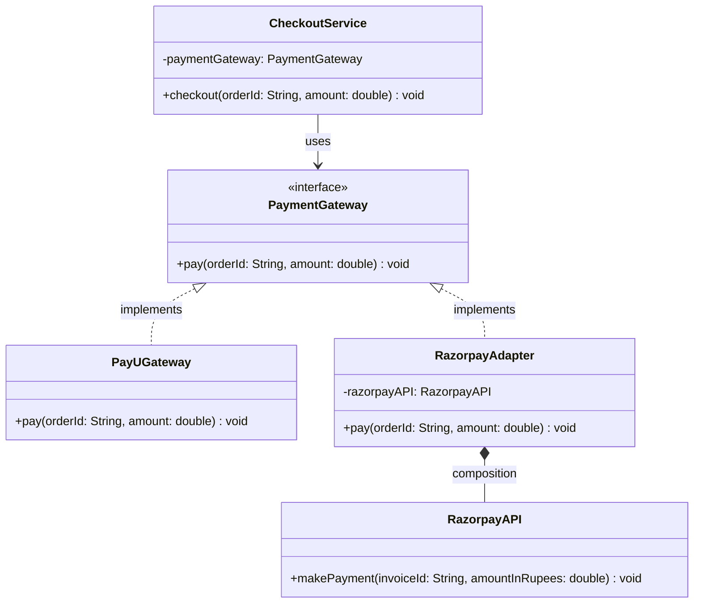

# Adapter Pattern

> The Adapter Pattern allows incompatible interfaces to work together by acting as a translator or wrapper around an existing class, converting one interface into another that a client expects.

## What You'll Learn

- What the Adapter Pattern is and the problem it solves
- The real-life analogy of a plug adapter
- How interface incompatibility breaks integration between classes
- How to implement the Adapter Pattern with a Payment Gateway example
- When to use the Adapter Pattern
- Advantages and disadvantages of the Adapter Pattern
- Real-world product use cases (Payment Gateways, Logging, Cloud SDKs)
- The class diagram showing all participants of the pattern

---

## Introduction

Structural design patterns are concerned with the composition of classes and objects. They focus on how to assemble classes and objects into larger structures while keeping these structures flexible and efficient. The Adapter Pattern is one of the most important structural design patterns.

---

## What Is the Adapter Pattern?

The Adapter Pattern allows incompatible interfaces to work together by acting as a translator or wrapper around an existing class. It converts the interface of a class into another interface that a client expects.

It acts as a bridge between the **Target interface** (expected by the client) and the **Adaptee** (an existing class with a different interface). This structural wrapping enables integration and compatibility across diverse systems.

---

## Real-Life Analogy

Imagine traveling from India to Europe. Your mobile charger does not fit into European sockets. Instead of buying a new charger, you use a plug adapter. The adapter allows your charger (with its Indian plug) to fit the European socket, enabling charging without modifying either the socket or the charger.

Similarly, the Adapter Pattern allows objects with incompatible interfaces to collaborate by introducing an adapter.

---

## Problem It Solves

- Interface incompatibility between classes.
- Reusability of existing classes without modifying their source code.
- Enables systems to communicate that otherwise could not due to differing method signatures.

---

## Real-Life Coding Example

Let's consider a scenario where we are implementing a **Payment Gateway System** with two different payment methods: PayU and Razorpay. While the PayU gateway already conforms to the expected interface, Razorpay follows a different structure.

### Without Adapter — Using Incompatible Interface

```java
import java.util.*;

// Target Interface:
// Standard interface expected by the CheckoutService
interface PaymentGateway {
    void pay(String orderId, double amount);
}

// Concrete implementation of PaymentGateway for PayU
class PayUGateway implements PaymentGateway {
    @Override
    public void pay(String orderId, double amount) {
        System.out.println("Paid Rs. " + amount + " using PayU for order: " + orderId);
    }
}

// Adaptee:
// An existing class with an incompatible interface
class RazorpayAPI {
    public void makePayment(String invoiceId, double amountInRupees) {
        System.out.println("Paid Rs. " + amountInRupees + " using Razorpay for invoice: " + invoiceId);
    }
}

// Client Class:
// Uses PaymentGateway interface to process payments
class CheckoutService {
    private PaymentGateway paymentGateway;

    // Constructor injection for dependency inversion
    public CheckoutService(PaymentGateway paymentGateway) {
        this.paymentGateway = paymentGateway;
    }

    // Business logic to perform checkout
    public void checkout(String orderId, double amount) {
        paymentGateway.pay(orderId, amount);
    }
}

class Main {
    public static void main(String[] args) {
        // Using PayU payment gateway to process payment
        CheckoutService checkoutService =
            new CheckoutService(new PayUGateway());

        checkoutService.checkout("12", 1780);
    }
}
```

### Understanding the Issues

- `CheckoutService` expects any payment provider to implement the `PaymentGateway` interface.
- `PayUGateway` fits this requirement and works correctly.
- `RazorpayAPI`, however, uses a different method (`makePayment`) and does not implement `PaymentGateway`.
- Due to this mismatch, `RazorpayAPI` cannot be used directly with `CheckoutService`.

This is a case of **interface incompatibility**, where similar functionalities cannot work together because of structural differences. To solve this without modifying existing code, we use the Adapter Pattern to make `RazorpayAPI` compatible with the expected interface.

---

### With Adapter Pattern

```java
import java.util.*;

// Target Interface:
// Standard interface expected by the CheckoutService
interface PaymentGateway {
    void pay(String orderId, double amount);
}

// Concrete implementation of PaymentGateway for PayU
class PayUGateway implements PaymentGateway {
    @Override
    public void pay(String orderId, double amount) {
        System.out.println("Paid Rs." + amount + " using PayU for order: " + orderId);
    }
}

// Adaptee:
// An existing class with an incompatible interface
class RazorpayAPI {
    public void makePayment(String invoiceId, double amountInRupees) {
        System.out.println("Paid Rs." + amountInRupees + " using Razorpay for invoice: " + invoiceId);
    }
}

// Adapter Class:
// Allows RazorpayAPI to be used where PaymentGateway is expected
class RazorpayAdapter implements PaymentGateway {
    private RazorpayAPI razorpayAPI;

    public RazorpayAdapter() {
        this.razorpayAPI = new RazorpayAPI();
    }

    // Translates the pay() call to RazorpayAPI's makePayment() method
    @Override
    public void pay(String orderId, double amount) {
        razorpayAPI.makePayment(orderId, amount);
    }
}

// Client Class:
// Uses PaymentGateway interface to process payments
class CheckoutService {
    private PaymentGateway paymentGateway;

    // Constructor injection for dependency inversion
    public CheckoutService(PaymentGateway paymentGateway) {
        this.paymentGateway = paymentGateway;
    }

    // Business logic to perform checkout
    public void checkout(String orderId, double amount) {
        paymentGateway.pay(orderId, amount);
    }
}

class Main {
    public static void main(String[] args) {
        // Using razorpay payment gateway adapter to process payment
        CheckoutService checkoutService =
            new CheckoutService(new RazorpayAdapter());

        checkoutService.checkout("12", 1780);
    }
}
```

Here, we created an adapter class `RazorpayAdapter` that implements the `PaymentGateway` interface. The adapter internally uses the `RazorpayAPI` class and translates the method calls from the expected interface to the actual implementation.

This allows us to use `RazorpayAPI` seamlessly with the `CheckoutService` without modifying either class.

---

## Class Diagram

The diagram below illustrates the Adapter Pattern. The `PaymentGateway` interface is the **target interface**, while `RazorpayAPI` is the **adaptee**. The `RazorpayAdapter` acts as a bridge, allowing the client to interact with the adaptee through the target interface.



---

## When to Use the Adapter Pattern

The Adapter Pattern is ideal in scenarios where you are trying to integrate components that were not originally designed to work together. It proves especially useful when:

- You need to use an existing class, but its interface does not match the one your system expects.
- You want to reuse legacy code without modifying its internal structure.
- You are integrating third-party APIs or external services into your application.

In such cases, the Adapter Pattern serves as a bridge, allowing seamless compatibility without altering existing codebases.

---

## Advantages and Disadvantages

### Pros

- **Code Reusability**: Encourages the reuse of existing classes without changing their implementation.
- **Code Extensibility**: Makes systems more flexible and adaptable to change.
- **Minimal Changes to Client Code**: Enables integration without requiring modifications to existing client logic.
- **Simplifies Third-party Integration**: Makes it easier to incorporate external services and APIs.

### Cons

- **Adds an Extra Layer of Abstraction**: Can introduce unnecessary complexity if not used judiciously.
- **Overuse Can Obscure System Design**: Excessive use of adapters might make the architecture harder to understand and maintain.

---

## Real Product Use Cases

The Adapter Pattern is not just a theoretical concept — it plays a crucial role in real-world software products and systems. Many enterprise-level applications rely on this pattern to integrate with third-party tools, legacy systems, and platform-specific APIs.

### 1. Payment Gateways

**Scenario**: Different payment providers (e.g., PayPal, Stripe, Razorpay, PayU) expose their own APIs with varying method names, parameters, and response formats.

**Adapter Use**: By implementing a common `PaymentGateway` interface and creating adapters for each provider, businesses can switch or support multiple gateways without rewriting business logic. This decouples the checkout flow from provider-specific implementations.

### 2. Logging Frameworks

**Scenario**: Enterprise applications often need to support different logging libraries like Log4j, SLF4J, or custom logging solutions.

**Adapter Use**: An adapter can unify the logging interface so developers can write `log.debug(...)`, regardless of whether the underlying implementation is Log4j or `java.util.logging`. This makes it easier to switch or support multiple logging backends with minimal changes.

### 3. Cloud Providers and SDKs

**Scenario**: Cloud platforms like AWS, Azure, and Google Cloud offer similar functionalities (storage, compute, database) but expose them through different SDKs and APIs.

**Adapter Use**: Using an adapter layer, developers can abstract cloud operations behind a common interface, enabling them to change providers (e.g., from AWS S3 to Google Cloud Storage) without impacting the rest of the application. This is particularly useful for hybrid-cloud or multi-cloud strategies.

---

## Summary

| **Concept** | **Description** |
| :--- | :--- |
| **Pattern Type** | Structural Design Pattern |
| **Intent** | Convert an incompatible interface into one the client expects |
| **Target Interface** | The interface the client (`CheckoutService`) depends on (`PaymentGateway`) |
| **Adaptee** | The existing class with an incompatible interface (`RazorpayAPI`) |
| **Adapter** | The wrapper class that bridges target and adaptee (`RazorpayAdapter`) |
| **Client** | The class that uses the target interface (`CheckoutService`) |
| **Key Benefit** | Enables reuse of existing classes without modifying their source code |
| **Key Trade-off** | Adds an extra layer of abstraction that can increase complexity |
| **When to Use** | Integrating legacy code, third-party APIs, or systems with differing interfaces |
