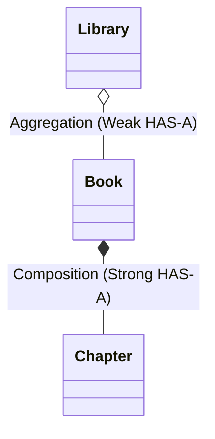

# Relationships Between Classes in Java

In Object-Oriented Programming (OOP), classes are the foundational building blocks that define the structure and behavior of objects. One of the most important concepts in OOP is how these classes interact and relate to each other.

These interactions, or relationships, allow developers to model real-world systems effectively. In Java, relationships between classes generally fall into three major types: **Association**, **Aggregation**, and **Composition** (alongside **Inheritance / "is-a"**, which was covered in earlier chapters).

## What You'll Learn

By the end of this chapter, you'll understand:

- The core concept of class relationships in OOP
- What **Association** is and its types (One-to-One, One-to-Many, Many-to-Many)
- What **Aggregation** is (Weak "has-a" relationship)
- What **Composition** is (Strong "part-of" relationship)
- How Aggregation and Composition differ in lifecycle management and ownership
- How classes can participate in multiple relationships simultaneously
- A comprehensive comparison between Association, Aggregation, and Composition

---

## Overview of Class Relationships

In object-oriented design, class relationships define how objects communicate, share data, and depend on one another.

```
Relationships
├── IS-A Relationship (Inheritance)
└── HAS-A / Interacts Relationship (Association)
      ├── Association (General Interaction)
      ├── Aggregation (Weak HAS-A, Independent Lifecycle)
      └── Composition (Strong HAS-A / Part-Of, Dependent Lifecycle)
```

| Relationship Type | Description | Strength | Lifecycle Dependency |
| :--- | :--- | :--- | :--- |
| **Association** | General linkage / interaction between classes | Loose | None |
| **Aggregation** | Whole-part relationship where parts can exist independently | Moderate ("has-a") | Independent |
| **Composition** | Whole-part relationship where parts cannot exist without the whole | Strong ("part-of") | Dependent |

---

## 1. Association

### Definition

**Association** represents a general binary relationship between two separate classes where objects of one class interact with objects of another through some form of linkage or reference.

In association, there is **no ownership** between the objects — each object has its own independent lifecycle and creation mechanism.

### Multiplicity / Cardinality in Association

The connection between associated classes can have different cardinalities:

1. **One-to-One (1:1):** One instance of Class A is associated with exactly one instance of Class B.
   - *Example:* A `Person` and a `Passport`.
2. **One-to-Many (1:N):** One instance of Class A is associated with multiple instances of Class B.
   - *Example:* A `Teacher` and multiple `Student` objects.
3. **Many-to-Many (M:N):** Many instances of Class A are associated with many instances of Class B.
   - *Example:* `Student` and `Course` (a student enrolls in many courses; a course has many students).

### Implementation

In Java, association is implemented simply by keeping a reference (or a collection of references) to one class inside another.

```java
import java.util.*;

// Bank Class
class Bank {
    private String name;

    Bank(String name) {
        this.name = name;
    }

    public String getName() {
        return this.name;
    }
}

// Employee Class
class Employee {
    private String name;

    Employee(String name) {
        this.name = name;
    }

    public String getName() {
        return this.name;
    }
}

// Association Demonstration
class Main {
    public static void main(String[] args) {
        Bank bank = new Bank("State Bank");
        Employee emp = new Employee("John Doe");

        // General association: Employee works with/at a Bank
        System.out.println(emp.getName() + " is associated with " + bank.getName());
    }
}
```

**Keypoints:**
- Represents a **general interaction** or "uses-a" / "works-with" connection.
- No ownership involved.
- Both entities exist independently in memory and have separate lifecycles.

---

## 2. Aggregation (Weak "HAS-A" Relationship)

### Definition

**Aggregation** is a specialized, unidirectional form of association. It represents a **"whole-part"** relationship (also known as a **"has-a"** relationship) where the "part" can exist independently of the "whole".

In aggregation, the container (whole) references the contained object (part), but **does not own or control its lifecycle**. If the container object is garbage collected or destroyed, the contained objects continue to exist.

### Example: Department and Employees

An `Employee` belongs to a `Department`. However, if the `Department` is closed or deleted, the `Employee` objects are not destroyed — they can exist independently or move to another department.

```java
import java.util.*;

// Part Class
class Employee {
    private String name;

    public Employee(String name) {
        this.name = name;
    }

    public String getName() {
        return name;
    }
}

// Whole / Container Class
class Department {
    private String deptName;
    private List<Employee> employees; // Aggregation: holds references passed from outside

    public Department(String deptName, List<Employee> employees) {
        this.deptName = deptName;
        this.employees = employees;
    }

    public void showEmployees() {
        System.out.println("Department: " + deptName);
        for (Employee emp : employees) {
            System.out.println(" - " + emp.getName());
        }
    }
}

class Main {
    public static void main(String[] args) {
        // Employees are created independently outside the Department
        Employee emp1 = new Employee("Alice");
        Employee emp2 = new Employee("Bob");

        List<Employee> empList = new ArrayList<>();
        empList.add(emp1);
        empList.add(emp2);

        // Aggregating employees into a Department
        Department dept = new Department("Engineering", empList);
        dept.showEmployees();

        // If dept becomes null, emp1 and emp2 still exist!
        dept = null;
        System.out.println("Employee still exists: " + emp1.getName()); // Alice
    }
}
```

### Characteristics of Aggregation

- **Independence:** The lifecycle of the "part" is **not dependent** on the "whole".
- **External Creation:** The contained objects are typically created **outside** the container class and passed in via constructors or setters.
- **Weaker Bond:** Less tightly coupled than composition.
- **Shared Parts:** A part can theoretically be referenced by multiple containers.

---

## 3. Composition (Strong "HAS-A" / "Part-Of" Relationship)

### Definition

**Composition** is a stricter, stronger form of aggregation where the "whole" and "part" are **tightly coupled**. It represents a **"part-of"** relationship where the "part" **cannot exist without the "whole"**.

In composition, the container class is directly responsible for the creation, management, and destruction of the contained objects. If the container (whole) object is destroyed, all its component (part) objects are destroyed along with it.

### Example: House and Rooms

A `House` contains `Room` objects. A room cannot exist without the house it belongs to. If the `House` is demolished (deleted), the `Room` objects cease to exist.

```java
import java.util.*;

// Part Class
class Room {
    private String name;

    public Room(String name) {
        this.name = name;
    }

    public String getName() {
        return name;
    }
}

// Whole Class
class House {
    private List<Room> rooms; // Composition: House creates and manages Room lifecycle

    public House() {
        // Rooms are instantiated INSIDE the House constructor
        this.rooms = new ArrayList<>();
        this.rooms.add(new Room("Living Room"));
        this.rooms.add(new Room("Master Bedroom"));
        this.rooms.add(new Room("Kitchen"));
    }

    public void showRooms() {
        System.out.println("House contains:");
        for (Room r : rooms) {
            System.out.println(" - " + r.getName());
        }
    }
}

class Main {
    public static void main(String[] args) {
        House house = new House();
        house.showRooms();

        // When house is destroyed/collected, its internal rooms are also discarded
    }
}
```

### Characteristics of Composition

- **Total Dependency:** The lifecycle of the "part" is entirely dependent on the "whole".
- **Internal Creation:** The contained objects are usually created **inside** the container class (e.g., in its constructor).
- **Stronger Bond / Ownership:** The container has exclusive ownership of the parts.
- **No Sharing:** A part object cannot belong to more than one whole simultaneously.

> [!TIP]
> **Rule of Thumb:**
> - If deleting Object A should **NOT** delete Object B → Use **Aggregation**.
> - If deleting Object A **MUST** delete Object B → Use **Composition**.

---

## Multiple Relationships in Real-World Systems

In complex software systems, a single class often participates in multiple types of relationships simultaneously.

### Example: Library System

- A `Library` has an **Aggregation** relationship with `Book` (books can exist outside the library, e.g., checked out or moved to another branch).
- A `Book` has a **Composition** relationship with `Chapter` (a chapter cannot exist without the book it belongs to).

```java
import java.util.*;

// Chapter class (Part of Book)
class Chapter {
    private String title;

    public Chapter(String title) {
        this.title = title;
    }

    public String getTitle() {
        return title;
    }
}

// Book class (Owns Chapters via Composition, is aggregated into Library)
class Book {
    private String title;
    private List<Chapter> chapters; // Composition

    public Book(String title) {
        this.title = title;
        this.chapters = new ArrayList<>();
        // Chapters are created inside Book
        this.chapters.add(new Chapter("Chapter 1: Introduction"));
        this.chapters.add(new Chapter("Chapter 2: Core Concepts"));
    }

    public String getTitle() {
        return title;
    }
}

// Library class (Aggregates Books)
class Library {
    private String name;
    private List<Book> books; // Aggregation

    public Library(String name, List<Book> books) {
        this.name = name;
        this.books = books; // Books created externally
    }
}
```



---

## Comparison Table

| Aspect | Association | Aggregation | Composition |
| :--- | :--- | :--- | :--- |
| **Relationship Type** | General Linkage | Weak "HAS-A" (Whole-Part) | Strong "HAS-A" / "Part-Of" |
| **Ownership** | No ownership | Has container, but no exclusive lifecycle ownership | Strict exclusive ownership |
| **Lifecycle Dependency** | Independent lifecycles | Independent lifecycles | Dependent lifecycle (parts die with whole) |
| **Object Creation** | Created independently | Created independently, passed into container | Created inside the container class |
| **UML Notation** | Solid line (`───`) | Clear diamond (`◇───`) | Filled diamond (`◆───`) |
| **Real-world Example** | `Teacher` and `Student` | `Department` and `Employee` | `House` and `Room`, `Car` and `Engine` |

---

## Summary

| Concept | Key Takeaway |
| :--- | :--- |
| **Association** | General relationship between two classes without lifecycle binding or ownership |
| **Aggregation** | Whole-part relationship where the part can survive independently of the whole |
| **Composition** | Whole-part relationship where the part cannot exist without the whole |
| **Design Principle** | Favor composition/aggregation over inheritance to build flexible, loosely coupled systems |
